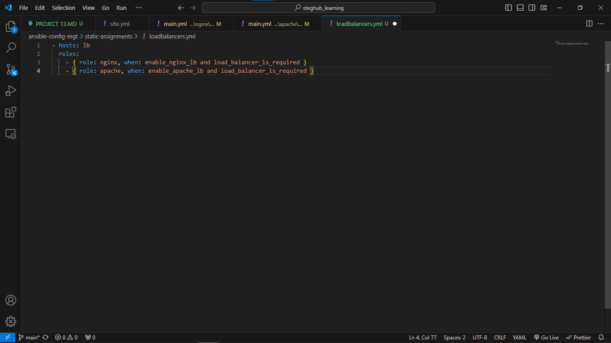
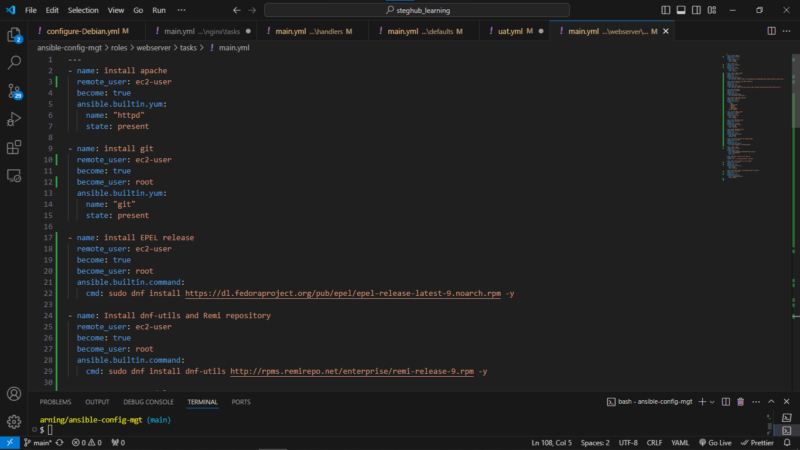

# Ansible Dynamic Assignments (Include) and Community Roles

### This project will further give us more understand about the differnt bettween a static andible and dynamic one.

## STEP 1: Introducing Dynamic Assignment Into Our structure

Create a new folder, name it dynamic-assignments. Then inside this folder, create a new file and name it env-vars.yml. We will instruct site.yml to include this playbook later. For now, let us keep building up the structure.

Since we will be using the same Ansible to configure multiple environments, and each of these environments will have certain unique attributes, such as servername, ip-address etc., we will need a way to set values to variables per specific environment.

For this reason, we will now create a folder to keep each environment's variables file. Therefore, create a new folder env-vars, then for each environment, create new YAML files which we will use to set variables.

Your layout should now look like this.


Now paste the instruction below into the env-vars.yml file.

```
---
- name: collate variables from env specific file, if it exists
  hosts: all
  tasks:
    - name: looping through list of available files
      include_vars: "{{ item }}"
      with_first_found:
        - files:
            - dev.yml
            - stage.yml
            - prod.yml
            - uat.yml
          paths:
            - "{{ playbook_dir }}/../env-vars"
      tags:
        - always

# This can be be writen as the following:

---
vars_files:
  - "{{ playbook_dir }}/../../env-vars/dev.yml"
  - "{{ playbook_dir }}/../../env-vars/stage.yml"
  - "{{ playbook_dir }}/../../env-vars/prod.yml"
  - "{{ playbook_dir }}/../../env-vars/uat.yml"
```

The code block above is an env yaml file that references other env variables files and thier location, so when the playbook searches for env variables, it goes directly through the folders specified. The two code can do same thing.

In site.yml file add the following code to it. This will make use of the dynamic assignment

```
---
- name: Include dynamic variables
  hosts: all
  tasks:
    - include-vars: ../dynamic-assignment/env-vars.yml
      tags:
        - always

- hosts: webservers
  name: Webserver assignment
- import_playbook: ../static-assignments/uat-webservers.yml
  
#- import_playbook: ../static-assignments/common.yml 

- import_playbook: ../static-assignments/db-servers.yml

  import_playbook: ../static-assignments/loadbalancers.yml
  when: load_balancer_is_required 
```


This above playbook, we are simply referencing the dynamic-assignments/env-vars.yml file as well as importing other playbooks, this way, it is easier to manage and run multiple playbooks inside one general playbook.


## STEP 2: Creating a role for MYSQL database.
 There are tons of roles that have already been developed by other open source engineers out there. These roles are actually production ready, and dynamic to accomodate most of Linux flavours. With Ansible Galaxy again, we can simply download a ready to use ansible role, and keep going.

 ```
 ansible-galaxy install geerlingguy.mysql
 ```

 Creat `mysql` folder and move `geerlingguy.mysql` to it.

 ```
 mv geerlingguy.mysql/ mysql
 ```

In `mysql/vars/main.yml` configure the database, this information will be use to add imfortion about the user and the password.

```
        mysql_root_password:
         mysql_databases:
           - name: ( input your required db name )
             encoding: latin1
             collation: latin1_general_ci
         mysql_users:
           - name:  ( include your required db user name )
             host: "( include the required subnet cidr ip address of your webservers )"
             password: ( include your required password for the db )
             priv: "(include the added db name).*:ALL"
```


In `static-assignments` folder create a file `db-servers.yml` inside it create a role

```
---
- hosts: db-servers
  become: yes
  vars_files:
    - vars/main.yml
  roles:
    - role: mysql
```


In `playbook/site.yml` file, create a new role 

```
- import_playbook: ../static-assignments/db-servers.yml
```
 

## STEP 3: Download and install Nginx and Apache load balancer role

You need to add a condition to enable either one - this is where you can make use of variables.


Download and install apache
 ```
 ansible-galaxy install geerlingguy.apache
 ```

 Creat `apache` folder and move `geerlingguy.apache` to it.

 ```
 mv geerlingguy.apache/ apache
 ```

Download and install nginx
  ```
 ansible-galaxy install geerlingguy.nginx
 ```

 Creat `nginx` folder and move `geerlingguy.nginx` to it.

 ```
 mv geerlingguy.nginx/ nginx
 ```
Since you cannot use both Nginx and Apache load balancer, you need to add a condition to enable either one - this is where you can make use of variables

Declare a variable in defaults/main.yml file inside the Nginx and Apache roles. Name each variables enable_nginx_lb and enable_apache_lb respectively.

Set both values to false like this enable_nginx_lb: false and enable_apache_lb: false.

Declare another variable in both roles load_balancer_is_required and set its value to false as well

Update both assignment and site.yml files respectively
loadbalancers.yml file

```
- hosts: lb
  roles:
    - { role: nginx, when: enable_nginx_lb and load_balancer_is_required }
    - { role: apache, when: enable_apache_lb and load_balancer_is_required }
```



Inside your `playbook/site.yml`, update the role with

```
- import_playbook: ../static-assignments/loadbalancers.yml
  when: load_balancer_is_required 
```
To activate load balancer, and enable either of Apache or Nginx load balancer, we can achieve this by setting these in the respective environment's env-vars file.

Inside `env-vars\uat.yml` file set it up to
```
---
load_balancer_is_required: true
enable_nginx_lb: true
enable_apache_lb: false
```


## STEP 4: Setup apache and Nginx roles to work as load balancer
**Setting up Apache**
To achieve the task of checking if Nginx is running and enabled, and if so, stopping and disabling it before proceeding to install and enable Apache, you can use the following Ansible tasks in your roles/apache/tasks/main.yml file. This will ensure that port 80 is free for the Apache load balancer

```
---
- name: Check if nginx is running
  ansible.builtin.service_facts:

- name: Stop and disable nginx if it is running
  ansible.builtin.service:
    name: nginx
    state: stopped
    enabled: no
  when: "'nginx' in services and services['nginx'].state == 'running'"
  become: yes
```


To enable the required Apache modules using a2enmod on a Debian-based system, you can create a task in the roles/apache/tasks/configure-debian.yml file as described. Additionally, you'll need to include a handler to restart Apache after enabling the modules.

Here’s the code to achieve this:

```
---
- name: Enable Apache modules
  ansible.builtin.shell:
    cmd: "a2enmod {{ item }}"
  loop:
    - rewrite
    - proxy
    - proxy_balancer
    - proxy_http
    - headers
    - lbmethod_bytraffic
    - lbmethod_byrequests
  notify: restart apache
  become: yes
```

Create another task to update the apache configurations with required code block needed for the load balancer to function. use the code below

```
- name: Insert load balancer configuration into Apache virtual host
  ansible.builtin.blockinfile:
    path: /etc/apache2/sites-available/000-default.conf
    block: |
      <Proxy "balancer://mycluster">
        BalancerMember http://<webserver1-ip-address>:80
        BalancerMember http://<webserver2-ip-address>:80
        ProxySet lbmethod=byrequests
      </Proxy>
      ProxyPass "/" "balancer://mycluster/"
      ProxyPassReverse "/" "balancer://mycluster/"
    marker: "# {mark} ANSIBLE MANAGED BLOCK"
    insertbefore: "</VirtualHost>"
  notify: restart apache
  become: yes
```

**Setting up Nginx**
To create a task in the `roles/nginx/tasks/main.yml` file to check if Apache is active and enabled, and if it is, to disable and stop Apache before proceeding with the tasks of installing Nginx

```
                     - name: Check if Apache is running
                       ansible.builtin.service_facts:
                     
                     - name: Stop and disable Apache if it is running
                       ansible.builtin.service:
                         name: apache2 
                         state: stopped
                         enabled: no
                       when: "'apache2' in services and services['apache2'].state == 'running'"
                       become: yes
```
In the roles/nginx/handlers/main.yml file, set nginx to always perform the tasks with sudo privileges, use the function : become: yes to achieve this

Do the same for all tasks that require sudo privileges

In the role/nginx/defaults/main.yml file, uncomment the nginx_vhosts, and nginx_upstream section

Under the nginx_vhosts section, ensure you have the same code 

```
                    nginx_vhosts:
                     - listen: "80" # default: "80"
                       server_name: "example.com" 
                       server_name_redirect: "example.com"
                       root: "/var/www/html" 
                       index: "index.php index.html index.htm" # default: "index.html index.htm"
                       # filename: "nginx.conf" # Can be used to set the vhost filename.
                   
                       locations:
                                 - path: "/"
                                   proxy_pass: "http://myapp1"
                   
                     # Properties that are only added if defined:
                       server_name_redirect: "www.example.com" # default: N/A
                       error_page: ""
                       access_log: ""
                       error_log: ""
                       extra_parameters: "" # Can be used to add extra config blocks (multiline).
                       template: "{{ nginx_vhost_template }}" # Can be used to override the `nginx_vhost_template` per host.
                       state: "present" # To remove the vhost configuration.
```


Under the nginx_upstream section, you wil need to update the servers address to include your webservers or uat servers.

Save and exit.

```
                   nginx_upstreams: 
                   - name: myapp1
                     strategy: "ip_hash" # "least_conn", etc.
                     keepalive: 16 # optional
                     servers:
                       - "<uat-server2-ip-address> weight=5"
                       - "<uat-server1-ip-address> weight=5"
```


Update the inventory/uat.yml to include the neccesary details for ansible to connect to each of these servers to perform all the roles we have specified. use the code below

```
                      [uat-webservers]
                      <server1-ipaddress> ansible_ssh_user=<ec2-user> 
                      <server2-ip address> ansible_ssh_user=<ec2-user> 
                     
                      [lb]
                      <lb-instance-ip> ansible_ssh_user=<ec2-user> 
                                            
```

## STEP 5: Configure webservers and installing PHP and it dependencies

In the `roles/webserver/tasks/main.yml` , write the following tasks. use the code below

```
---
- name: Install Apache
  ansible.builtin.yum:
    name: httpd
    state: present

- name: Install Git
  ansible.builtin.yum:
    name: git
    state: present

- name: Install EPEL release
  ansible.builtin.command:
    cmd: sudo dnf install https://dl.fedoraproject.org/pub/epel/epel-release-latest-9.noarch.rpm -y

- name: Install dnf-utils and Remi repository
  ansible.builtin.command:
    cmd: sudo dnf install dnf-utils http://rpms.remirepo.net/enterprise/remi-release-9.rpm -y

- name: Reset PHP module
  ansible.builtin.command:
    cmd: sudo module reset php -y

- name: Install PHP and extensions
  ansible.builtin.yum:
    name:
      - php
      - php-opcache
      - php-gd
      - php-curl
      - php-mysqlnd
      - php-common
      - php-mbstring
      - php-intl
      - php-xml
      - php-fpm
      - php-json
    enablerepo: remi-7.4
    state: present

- name: Install MySQL Client
  ansible.builtin.yum:
    name: mysql
    state: present

- name: Start PHP-FPM Service
  ansible.builtin.service:
    name: php-fpm
    state: started

- name: Enable PHP-FPM Service
  ansible.builtin.systemd:
    name: php-fpm
    enabled: true

- name: Set SELinux boolean for httpd_execmem
  ansible.builtin.command:
    cmd: sudo setsebool -p httpd_execmem 1

- name: Clone a repository
  ansible.builtin.git:
    repo: https://github.com/GodwinGNS/tooling.git
    dest: /var/www/html
    force: yes

- name: Copy HTML content to one level up
  ansible.builtin.command:
    cmd: cp -r /var/www/html/html/ /var/www/

- name: Start Apache service if not started
  ansible.builtin.service:
    name: httpd
    state: started

- name: Recursively remove /var/www/html/html/ directory
  ansible.builtin.file:
    path: /var/www/html/html
    state: absent
```

the above code will install apache, install git, install php and all its dependencies, clone the website from out github repo,as well ascopy the website files into the /var/www/html.




Now it is time to upload the changes into your GitHub
```
git pull
git add .
git commit 
git push 
```

the playbook command against the inventory/uat files

```
                          ansible-playbook -i inventory/uat.yml playbooks/site.yml
```


To test this, you can update inventory for each environment and run Ansible against each environment.


We have learned and practiced how to use Ansible configuration management tool to prepare UAT environment for Tooling web solution.