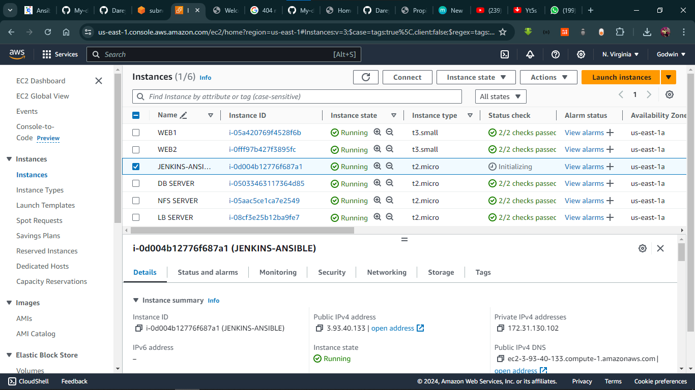
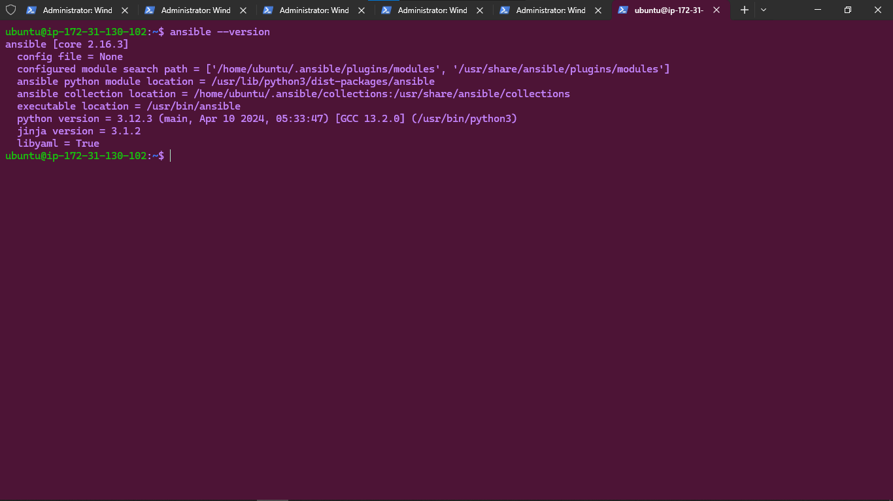
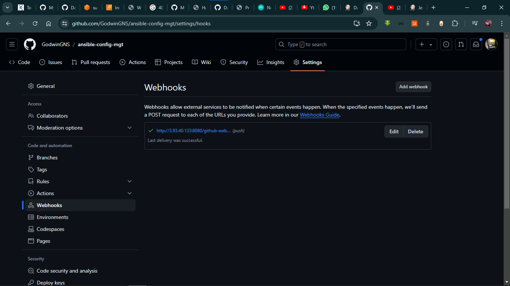
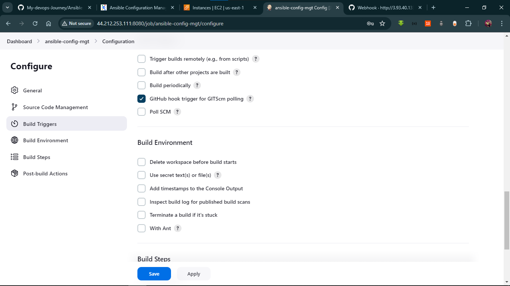

# Ansible Configuration Management (Automate Project 7 to 10)

## Step 1 - Install and Configure Ansible on EC2 Instance

1. Update the Name tag on your Jenkins EC2 Instance to Jenkins-Ansible. this will be use to create our playbook
   



2. Installing Ansible to ansible-jenkins server
   
```
sudo apt update

sudo apt install ansible
```

* Check the version of ansible running
```
ansible --version
```



 3. In GitHub account create a new repository and name it ansible-config-mgt.



4. Configure Jenkins build job to archive your repository content every time its been change it.

**The purpose is to solidify the jenkins configuration skill from our past project 9 learning**

* Create a new Freestyle project ansible in Jenkins and point it to your 'ansible-config-mgt' repository.


* Configure a webhook in GitHub and set the webhook to trigger ansible build.



* Configure a Post-build job to save all (**) files


* Test your setup by making some change in README.md file

```
ls /var/lib/jenkins/jobs/ansible/builds/<build_number>/archive/
```


**NOTE:**To avoid reconfiguring your github webhook each time you restart instance, it important that Elastic IP is allocated to the instance- like we did in project 10.


## Step 2 - Prepare your development environment using Visual Studio Code

1. Install and Set up Visual Studio Code (VSC).
2. Clone down your ansible-config-mgt repo to your Jenkins-Ansible instance

```
git clone <ansible-config-mgt repo link>
```


## Step 3 - Begin Ansible Development

1. In ansible-config-config-mgt GitHub repository, create a new branch that will be used for development of a new feature
2. Checkout the newly created feature branch to your local machine and start building your code and directory structure
3. Create a directory and name it playbooks - it will be used to store all your playbook files.
4. Create a directory and name it inventory - it will be used to keep your hosts organised.
5. Within the playbooks folder, create your first playbook, and name it common.yml
6. Within the inventory folder, create an inventory file () for each environment (Development, Staging Testing and Production) dev, staging, uat, and prod respectively. These inventory files
   


Update your inventory/dev.yml file with this snippet of code:

```
[nfs]
<NFS-Server-Private-IP-Address> ansible_ssh_user=ec2-user

[webservers]
<Web-Server1-Private-IP-Address> ansible_ssh_user=ec2-user
<Web-Server2-Private-IP-Address> ansible_ssh_user=ec2-user

[db]
<Database-Private-IP-Address> ansible_ssh_user=ec2-user 

[lb]
<Load-Balancer-Private-IP-Address> ansible_ssh_user=ubuntu
```

7


## Step 4 - Create a Common Playbook


In common.yml playbook you will write configuration for repeatable, re-usable, and multi-machine tasks that is common to systems within the infrastructure.

Update your playbooks/common.yml file with following code:

```
---
- name: update web, nfs and db servers
  hosts: webservers, nfs, db
  become: yes
  tasks:
    - name: ensure wireshark is at the latest version
      yum:
        name: wireshark
        state: latest
   

- name: update LB server
  hosts: lb
  become: yes
  tasks:
    - name: Update apt repo
      apt: 
        update_cache: yes

    - name: ensure wireshark is at the latest version
      apt:
        name: wireshark
        state: latest
```

**NOTE:**This playbook is divided into two parts, each of them is intended to perform the same task: install wireshark utility (or make sure it is updated to the latest version) on your RHEL 8 and Ubuntu servers. It uses root user to perform this task and respective package manager: yum for RHEL 8 and apt for Ubuntu.

We will update this playbook with following task;

* Create a directory and a file inside it
* Change timezone on all servers!
* Run some shell script

[alt text](IMAGES/11.png)

[alt text](IMAGES/12.png)

## Step 5 - Update GIT with the latest code
