# Ansible Configuration Management (Automate Project 7 to 10)

## Step 1 - Install and Configure Ansible on EC2 Instance

1. Update the Name tag on your Jenkins EC2 Instance to Jenkins-Ansible. this will be use to create our playbook
   


2. Installing Ansible to ansible-jenkins server
   
```
sudo apt update

sudo apt install ansible
```

* Check the version of ansible running
```
ansible --version
```


 3. In GitHub account create a new repository and name it ansible-config-mgt.


4. Configure Jenkins build job to archive your repository content every time its been change it.

**The purpose is to solidify the jenkins configuration skill from our past project 9 learning**

* Create a new Freestyle project ansible in Jenkins and point it to your 'ansible-config-mgt' repository.
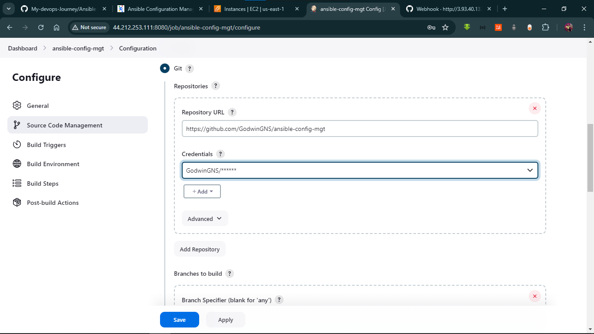

* Configure a webhook in GitHub and set the webhook to trigger ansible build.


* Configure a Post-build job to save all (**) files

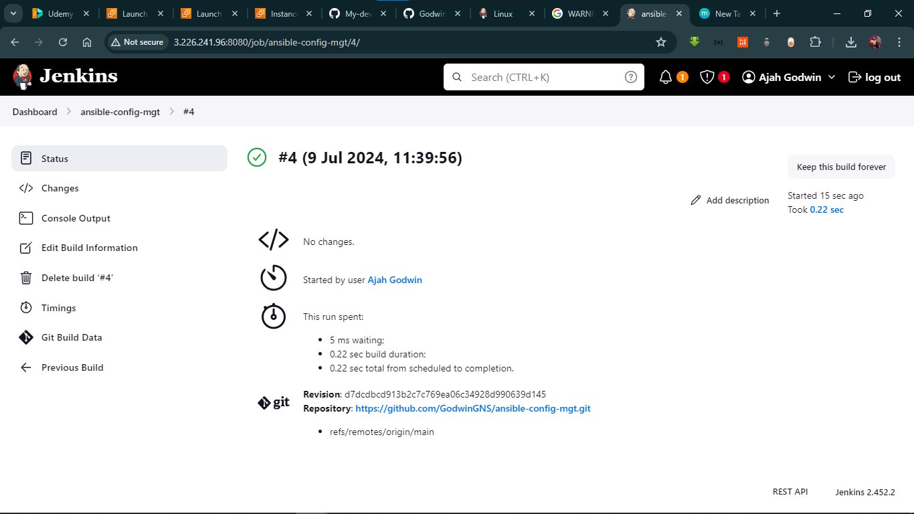
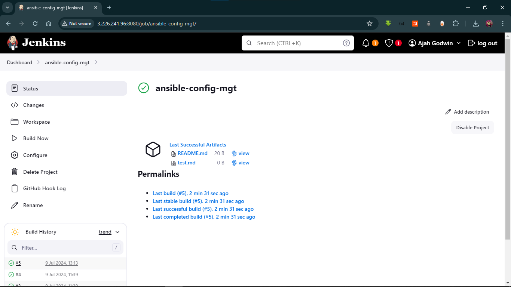

* Test your setup by making some change in README.md file

```
ls /var/lib/jenkins/jobs/ansible/builds/<build_number>/archive/
```
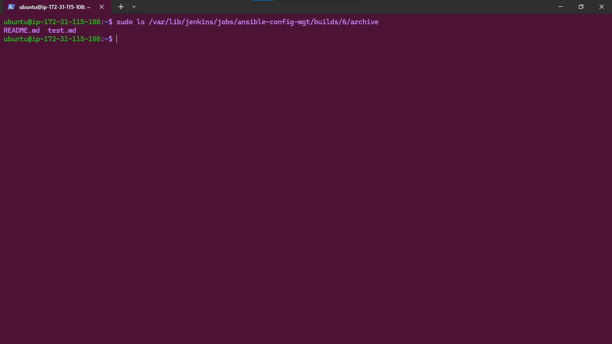

**NOTE:**To avoid reconfiguring your github webhook each time you restart instance, it important that Elastic IP is allocated to the instance- like we did in project 10.


## Step 2 - Prepare your development environment using Visual Studio Code

1. Install and Set up Visual Studio Code (VSC).
2. Clone down your ansible-config-mgt repo to your Jenkins-Ansible instance

```
git clone <ansible-config-mgt repo link>
```
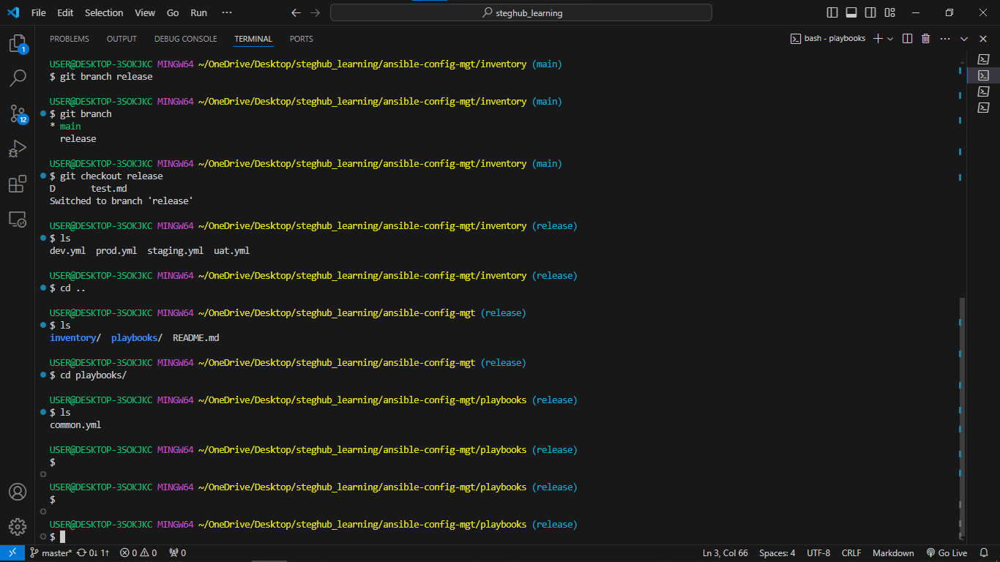

## Step 3 - Begin Ansible Development

1. In ansible-config-config-mgt GitHub repository, create a new branch that will be used for development of a new feature
2. Checkout the newly created feature branch to your local machine and start building your code and directory structure
```
git checkout
git branch <new_branch>
git checkout <new_branch>
```

3. Create a directory and name it playbooks - it will be used to store all your playbook files.
  * ansible-config-config-mgt, create a playbook and inventory directory
  ```
  mkdir playbook inventory
  ```
The inventory -  will be used to keep your hosts organised.

4. Within the playbooks folder, create your first playbook, and name it common.yml
```
touch common.yml
```

5. Within the inventory folder, create an inventory file () for each environment (Development, Staging Testing and Production) dev, staging, uat, and prod respectively. These inventory files
```
touch dev.yml staging.yml uat.yml prod.yml
```
   


Update your inventory/dev.yml file with this snippet of code:

```
[nfs]
<NFS-Server-Private-IP-Address> ansible_ssh_user=ec2-user

[webservers]
<Web-Server1-Private-IP-Address> ansible_ssh_user=ec2-user
<Web-Server2-Private-IP-Address> ansible_ssh_user=ec2-user

[db]
<Database-Private-IP-Address> ansible_ssh_user=ec2-user 

[lb]
<Load-Balancer-Private-IP-Address> ansible_ssh_user=ubuntu
```

7


## Step 4 - Create a Common Playbook


In common.yml playbook you will write configuration for repeatable, re-usable, and multi-machine tasks that is common to systems within the infrastructure.

Update your playbooks/common.yml file with following code:

```
---
- name: update web, nfs and db servers
  hosts: webservers, nfs, db
  become: yes
  tasks:
    - name: ensure wireshark is at the latest version
      yum:
        name: wireshark
        state: latest
   

- name: update LB server
  hosts: lb
  become: yes
  tasks:
    - name: Update apt repo
      apt: 
        update_cache: yes

    - name: ensure wireshark is at the latest version
      apt:
        name: wireshark
        state: latest
```

**NOTE:**This playbook is divided into two parts, each of them is intended to perform the same task: install wireshark utility (or make sure it is updated to the latest version) on your RHEL 8 and Ubuntu servers. It uses root user to perform this task and respective package manager: yum for RHEL 8 and apt for Ubuntu.

We will update this playbook with following task;

* Create a directory and a file inside it
* Change timezone on all servers!
* Run some shell script

[alt text](IMAGES/11.png)

[alt text](IMAGES/12.png)

## Step 5 - Update GIT with the latest code


In the real world, you will be working within a team of other DevOps engineers and developers. It is important to learn how to collaborate with help of GIT. In many organisations there is a development rule that do not allow to deploy any code before it has been reviewed by an extra pair of eyes - it is also called "Four eyes principle".

Now you have a separate branch, you will need to know how to raise a Pull Request (PR), get your branch peer reviewed and merged to the master branch.

Commit your code into GitHub:

```
git status

git add <selected files>

git commit -m "commit message"

git push origin release
```
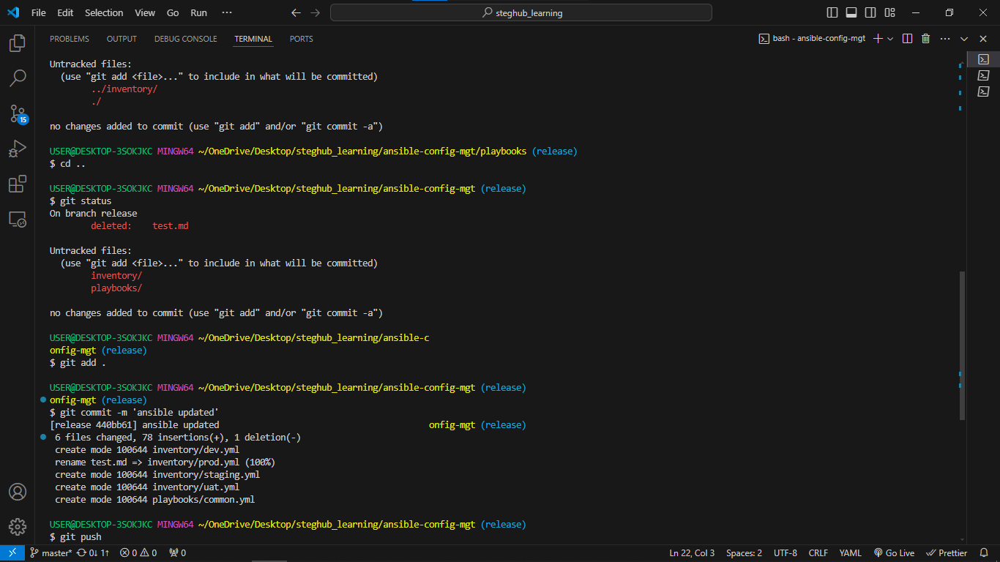

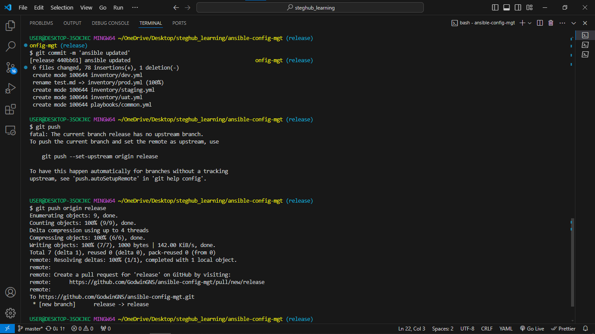

* Create a Pull Request (PR)

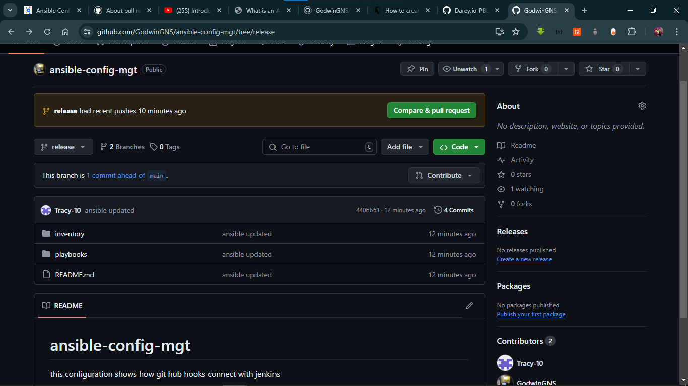

Wear the hat of another developer for a second, and act as a reviewer.

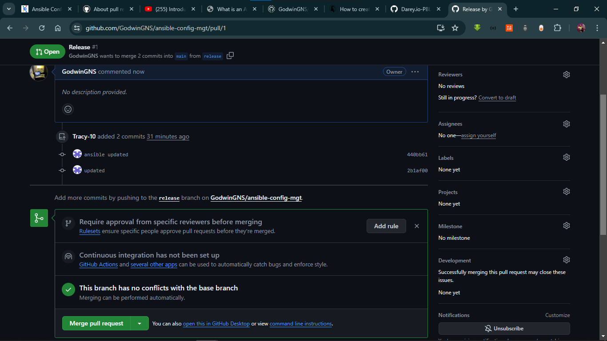
If the reviewer is happy with your new feature development, merge the code to the master branch.

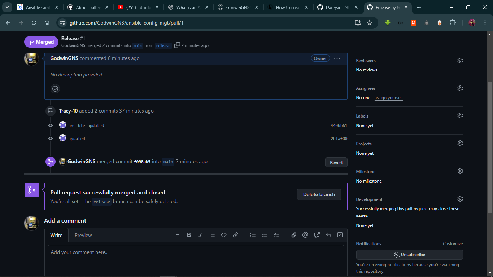

Head back on your terminal, checkout from the feature branch into the master, and pull down the latest changes
```
#checkout from release branch to main

git checkout main
git pull origin main
```
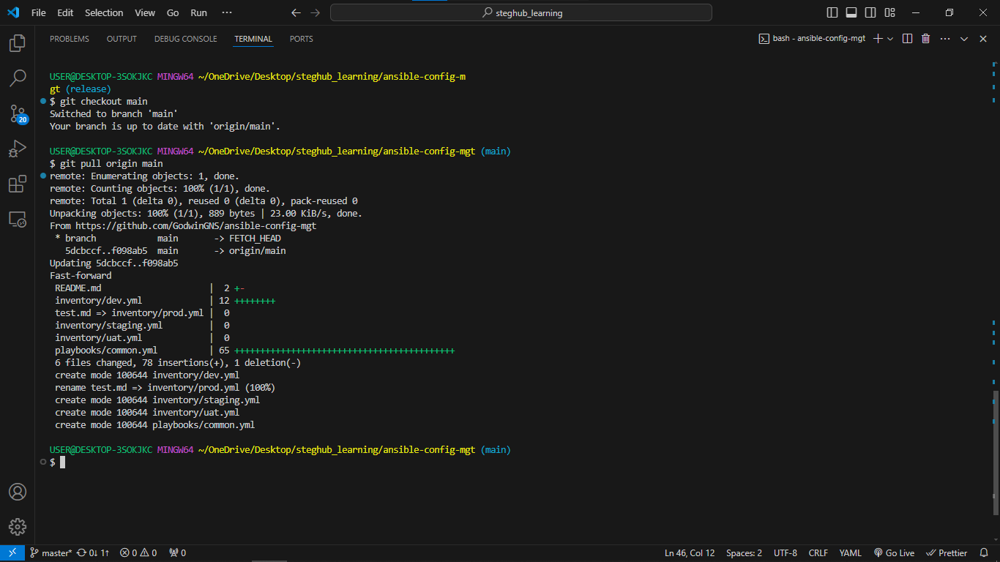


## Step 7 - Run the first Ansible test

Now, it is time to execute ansible-playbook command and verify if your playbook actually works:

* In VS code run
```
  cd /var/lib/jenkins/jobs/ansible/builds/<build_number>/archive/
```
  * Replace the path of ansible with anisble-config-mgt and build_number with your current jenkins build number.
  
  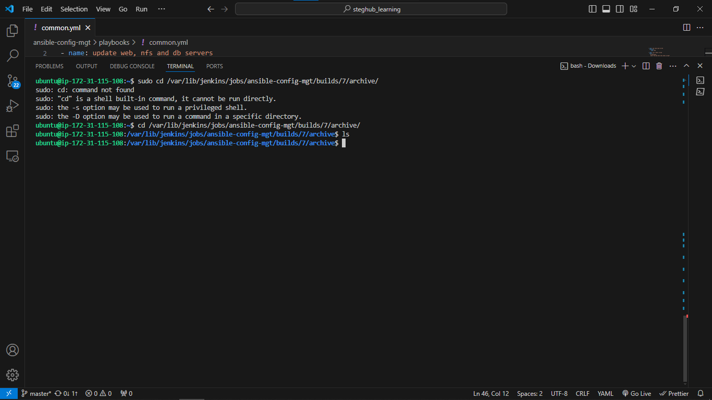
  * Now run your playbook using the command:
```
ansible-playbook -i inventory/dev.yml playbooks/common.yml
```
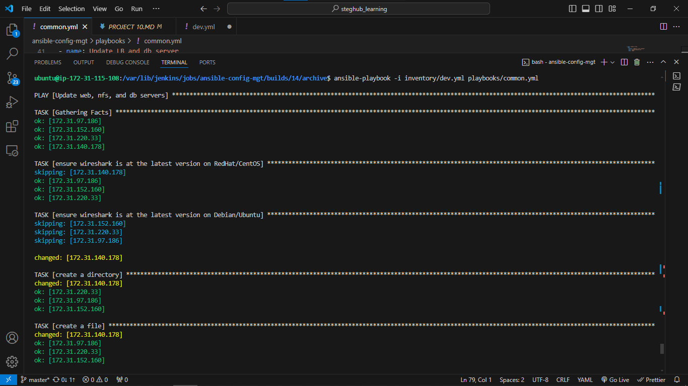

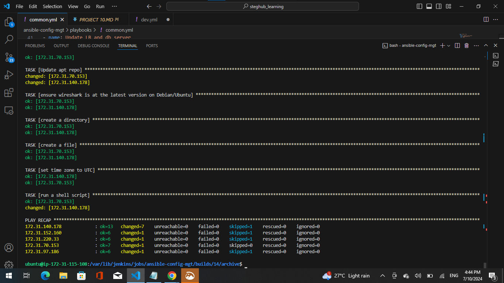

## Step 8 - Set up an ssh agent

* Ansible uses TCP port 22 by default, which means it needs to ssh into target servers from Jenkins-Ansible host - for this you can implement the concept of ssh-agent. Now you need to import your key into ssh-agent:

```
eval `ssh-agent -s`
ssh-add <path-to-private-key>
```
* Confirm the key has been added with the command below, you should see the name of your key
```
ssh-add -l 
```
* Now, ssh into your Jenkins-Ansible server using ssh-agent
```
ssh -A ubuntu@public-ip
```
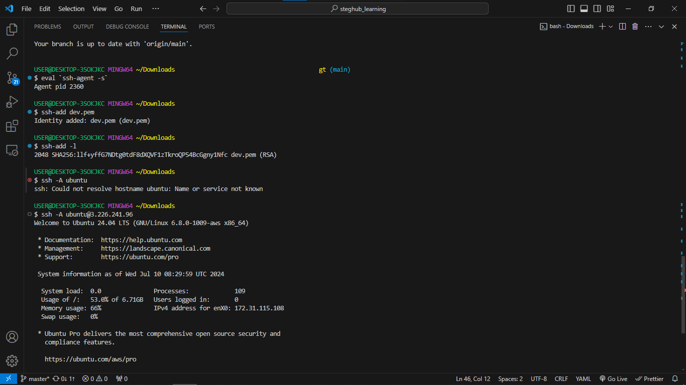

You can go to each of the servers and check if wireshark has been installed by running which wireshark or wireshark --version

For DB server
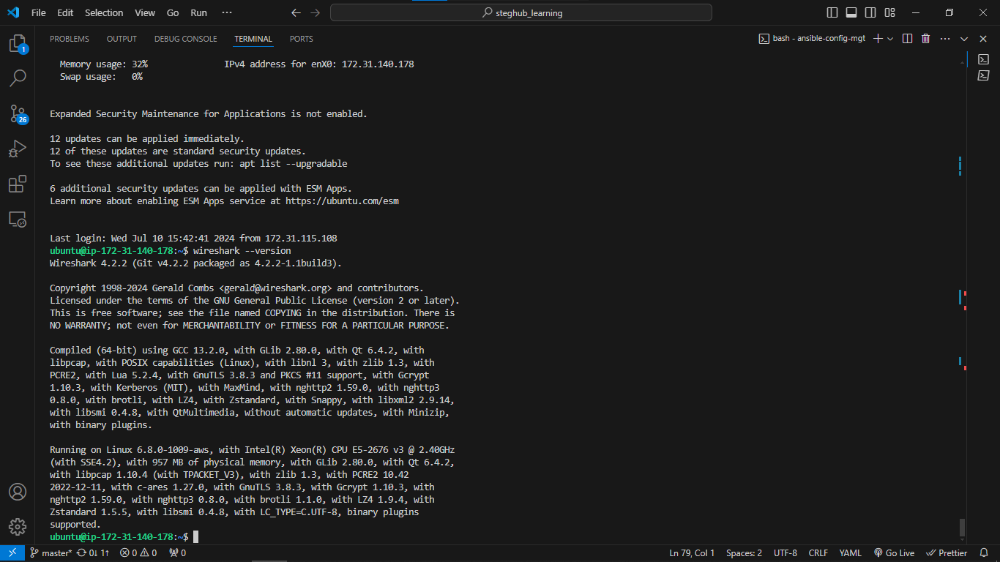

For LB server


For NFS server
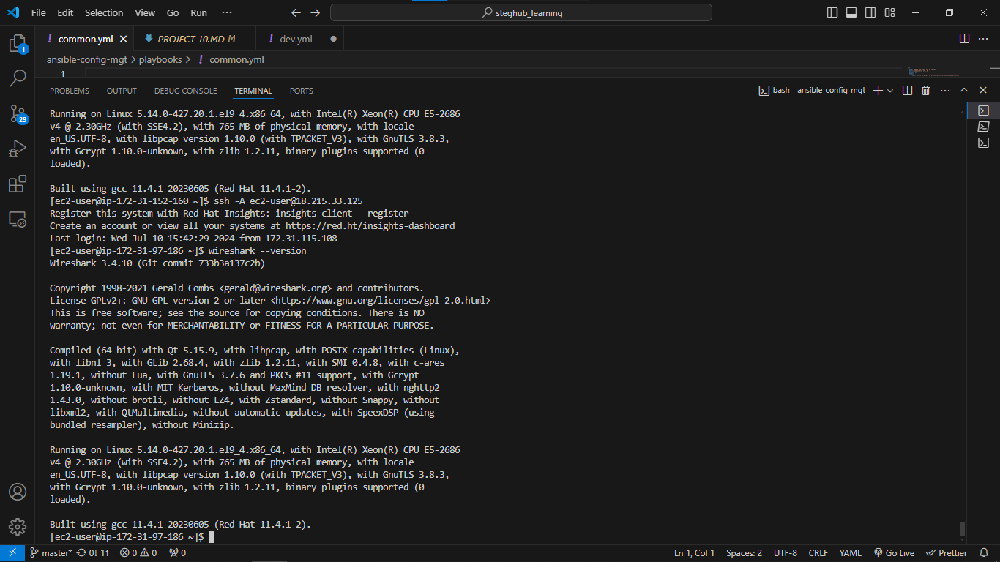

For WEB1 server
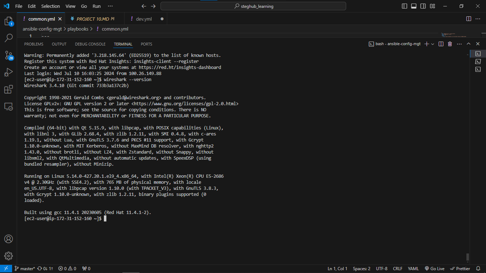

For WEB2 server
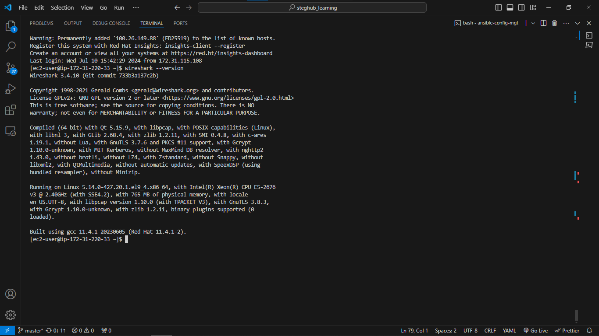

The updated with Ansible now look like this.

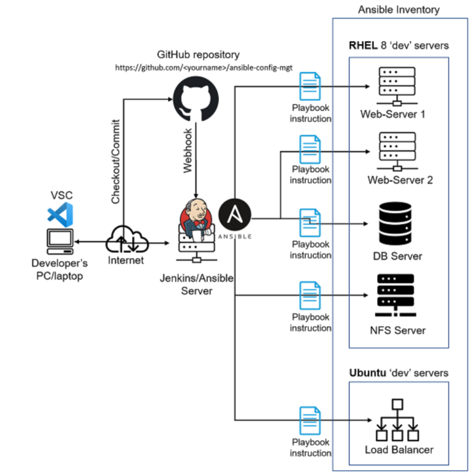