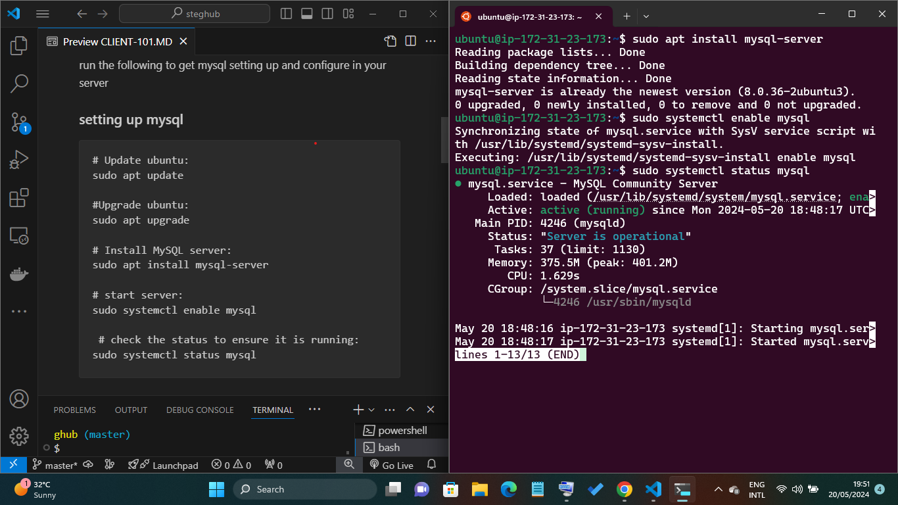
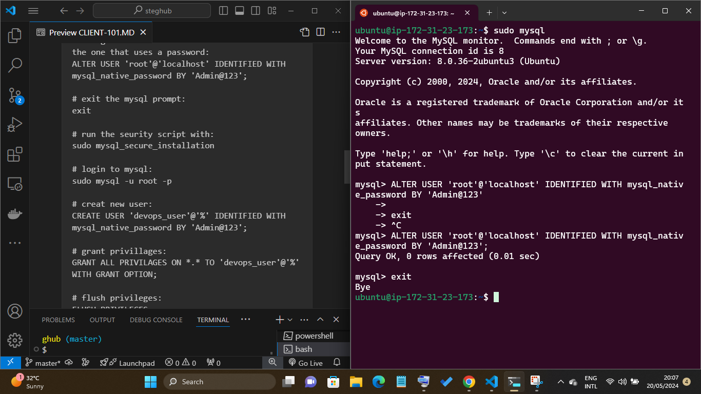
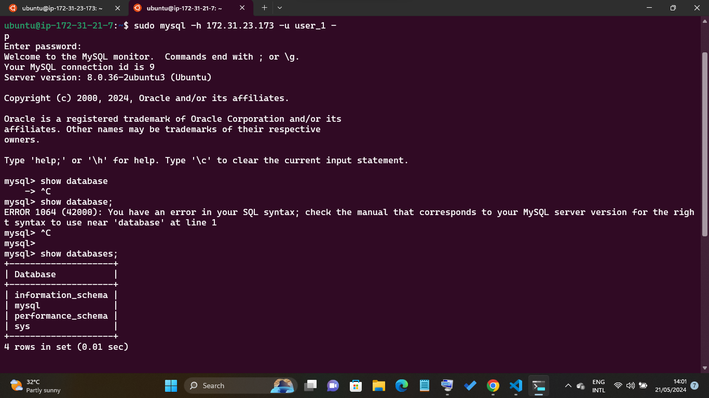
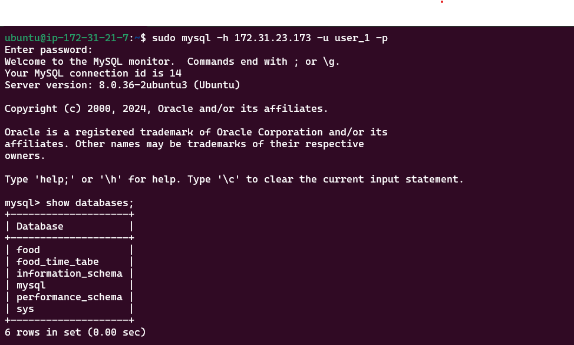
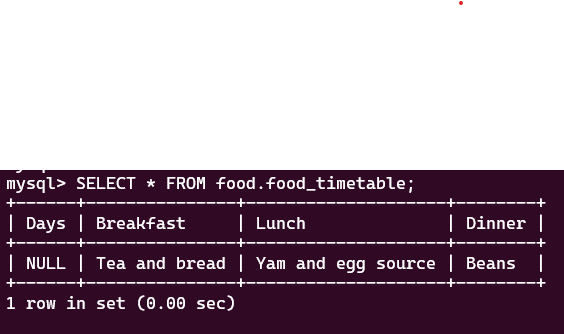

# Client-Server Architecture with MySQL

## Understanding Client-Server Architecture

Client-Server refers to an architecture in which two or more computers are connected together over a network to send and receive requests between one another.

In their communication, each machine has its own role: the machine sending requests is usually referred as "Client" and the machine responding (serving) is called "Server".


### Getting started with Client-Server Architecture with MySQL

**STEP.1**: Create and configure two Linux-based virtual servers (EC2 instances in AWS). 


```
Server A name - `mysql server`
Server B name - `mysql client`
```

**STEP.2**: Install mysql in mysql-server you created

run the following to get mysql setting up and configure in your server

### setting up mysql

```
# Update ubuntu:
sudo apt update

#Upgrade ubuntu:
sudo apt upgrade

# Install MySQL server:
sudo apt install mysql-server

# start server:
sudo systemctl enable mysql

 # check the status to ensure it is running:
sudo systemctl status mysql
```



### configuring mysql

```
# open up mysql promot:
sudo mysql

# change the root user authentication method to the one that uses a password:
ALTER USER 'root'@'localhost' IDENTIFIED WITH mysql_native_password BY 'Admin@123';

# exit the mysql prompt:
exit

# run the seurity script with:
sudo mysql_secure_installation

# login to mysql:
sudo mysql -u root -p

# creat new user:
CREATE USER 'user_1'@'%' IDENTIFIED WITH mysql_native_password BY 'Admin@123';

# grant privillages:
GRANT ALL PRIVILEGES ON *.* TO 'user_1'@'%' WITH GRANT OPTION;

# flush privileges:
FLUSH PRIVILEGES;

# exit mysql:
exit
```


change the root user authentication method to the one that uses a password


### Allowing connection from root server

```
sudo vi /etc/mysql/mysql.conf.d/mysqld.cnf
```

**exit mysql and restart mysql**

```
sudo systemctl restart mysql
```
**STEP.3**: Next, ssh into the client-server and repeat step 2 above on the client-server also.


**STEP.4**: 
By default, both of your EC2 virtual servers are located in the same local virtual network, so they can communicate to each other using local IP addresses. Use mysql server's local IP address to connect from mysql client. MySQL server uses TCP port 3306 by default, so you will have to open it by creating a new entry in 'Inbound rules' in 'mysql server' Security Groups. For extra security, do not allow all IP addresses to reach your 'mysql server' - allow access only to the specific local IP address of your 'mysql client'.


**STEP.5**: 
From MySQL client server connects remotely to the MySQL server database engine without using SSH. You must use the MySQL utility to perform this action.

```
sudo mysql -h <private ip> -u user_1 -p
```

Confirm that you have successfully perform SQL queries from the client server run:

```
show databases
````



## Playing around with my saver

Here am going to create a database of food i love so much

### In my service mysql 

```sudo mysql -u user_1 -p```

creating a new table of food_Database

1. create a database by name food
``CREATE DATABASE food``


2. create table
   ```
   mysql>  CREATE TABLE food.food_timetable (
    ->  Days INT,
    ->  Breakfast VARCHAR(255),
    ->  Lunch VARCHAR(255),
    ->  Dinner VARCHAR(255)
    ->  );
    ```


3. insert into my table
   ```
   mysql>   INSERT INTO food.food_timetable (Breakfast, Lunch, Dinner)
    -> VALUES ("Tea and bread", "Yam and egg source", "Beans");
    ```
    


exit mysql.


## In my client server

ssh into my client server

run:
```
 sudo mysql -h 172.31.23.173 -u user_1 -p
 ```

enter your mysql service password




To see the databases run:

```
show databases;
```

finally to see the fileds in our food table run:

```
 SELECT * FROM food.food_timetable;
```



Thank you for following through...


