# Setup and technologies used in Project 7

It's very important as a DevOps engineer to understand the verious setup tools within the corporate infrastructure.

We are going to implement a solution that consists of following components:

* infrastructure:AWS
* Webserver Linux: Red Hat Enterprise Linux 8
* Database Server: Ubuntu 24.04 + MySQL
* Storage Server: Red Hat Enterprise Linux 8 + NFS Server
* Programming Language: PHP
* Code Repository: GitHub

On the diagram below you can see a common pattern where several stateless Web Servers share a common database and also access the same files using Network File Sytem (NFS) as a shared file storage. Even though the NFS server might be located on a completely separate hardware - for Web Servers it look like a local file system from where they can serve the same files.

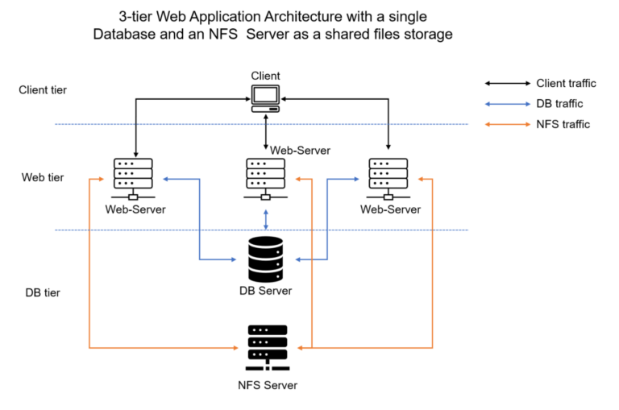


I n implementing a storage solution, it is important to know what storage solution is suitable for what use cases, for this - you need to answer following questions: 

1.  what data will be stored
2.  In what format
3.  how this data will be accessed
4.  by whom
5.  from where
6.  how frequently, etc
   
Base on this you will be able to choose the right storage system for your solution   


We are going using the follow steps implement our DevOps tooling website solution:

## Step 1 - Prepare NFS Server

* create ec2 t3 instance with RHEL Linux 8 Operating System
* create and attach 4 ebs volume on the instance
* ssh to the instance
  ```
  ssh -i <your pem key> ec2-user@<your instace public ip>

* list block  ``lsblk`` ``df -h``
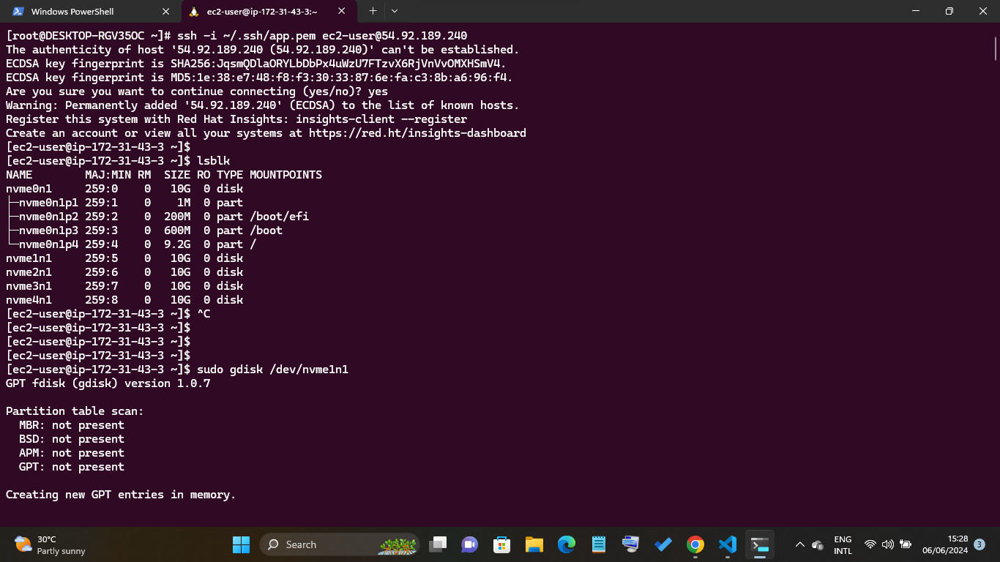

* partition your volumes
  ```
  sudo gdisk /dev/nvme1n1
  sudo gdisk /dev/nvme2n1
  sudo gdisk /dev/nvme3n1
  sudo gdisk /dev/nvme4n1
  ```
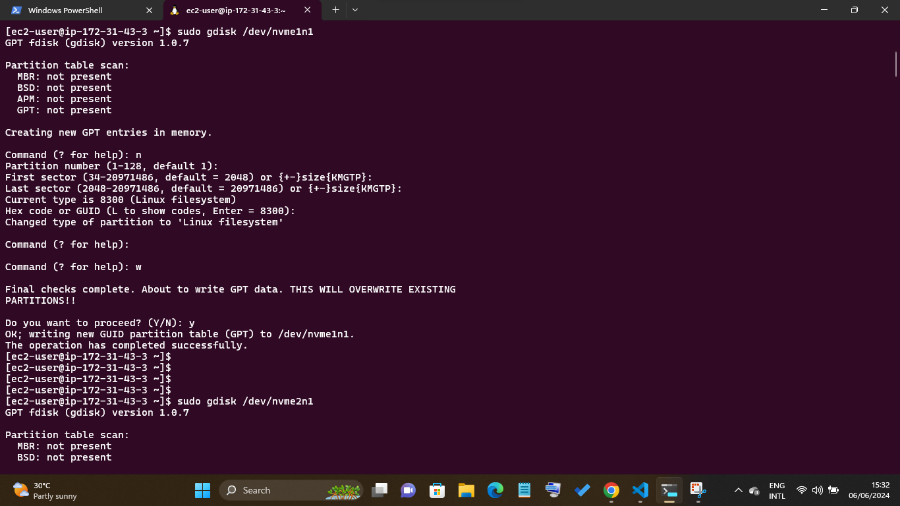

  * install lvm2 and check for the available parition
  ```
  sudo yum install lvm2
  sudo lvmdiskscan
  ```
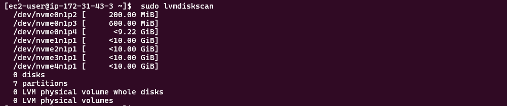
  * make of the 4 disk a pysical volume to be use by lvm
  ```
  sudo pvcreate /dev/nvme1n1p1
  sudo pvcreate /dev/nvme2n1p1
  sudo pvcreate /dev/nvme3n1p1
  sudo pvcreate /dev/nvme4n1p1

  sudo pvs 
  ```
  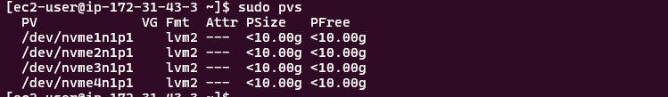

  * adding the pvs to a volume group (vg). we shall call it webdata-vg and verify
 ```
sudo vgcreate webdata-vg /dev/nvme1n1p1 /dev/nvme2n1p1 /dev/nvme3n1p1 /dev/nvme4n1p1

sudo vgs
```
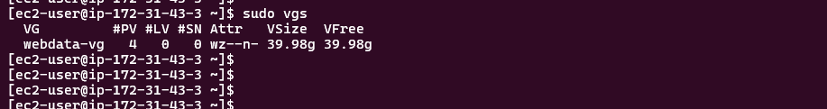
* create 3 local voulumes using lv-opt, lv-apps and lv-logs and verify if it successfuly runuing

```
sudo lvcreate -n opt-lv -L 12G webdata-vg
sudo lvcreate -n apps-lv -L 12G webdata-vg
sudo lvcreate -n logs-lv -L 12G webdata-vg

sudo lvs
```
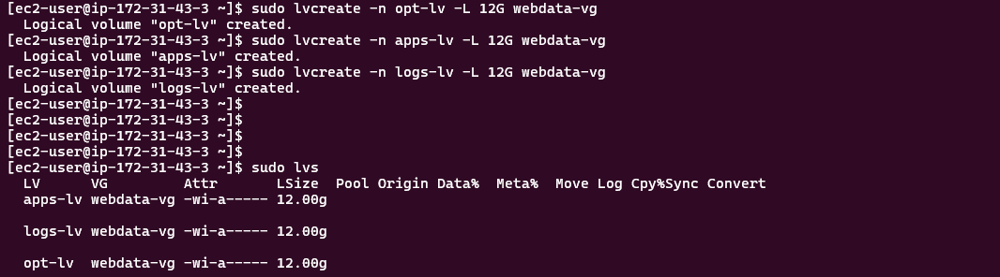
* you can verify all your setup with:
```
sudo vgdisplay -v #view complete setup - VG, PV, and LV
sudo lsblk 
```

* format the logical volume with xfs files system
```
sudo mkfs -t xfs /dev/webdata-vg/apps-lv
sudo mkfs -t xfs /dev/webdata-vg/logs-lv
sudo mkfs -t xfs /dev/webdata-vg/opt-lv
```
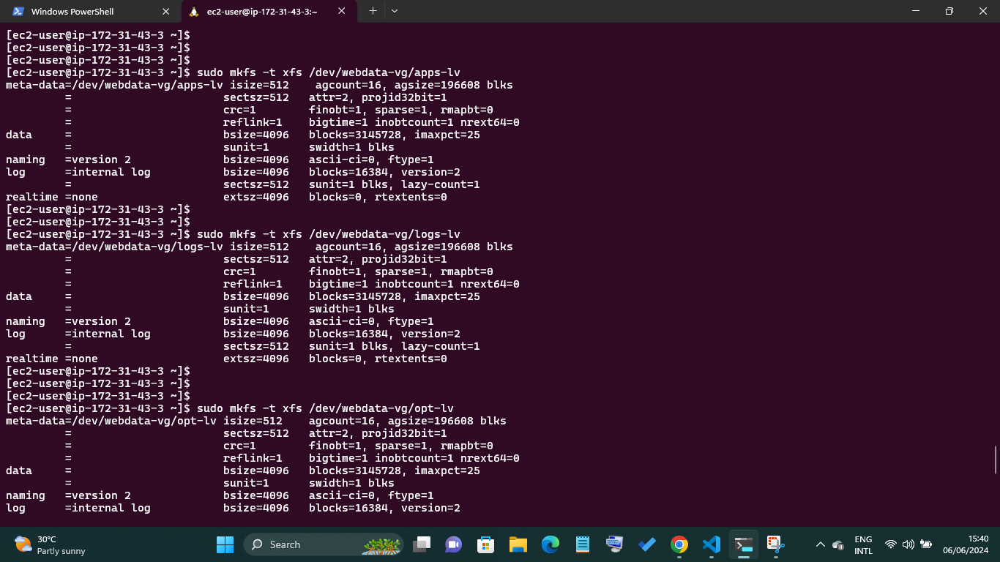
* Create mount points on /mnt directory for the logical volumes
```
sudo mkdir /mnt/apps
sudo mkdir /mnt/logs
sudo mkdir /mnt/opt
```
* mounting our directory to it's repective logical volumes:
```
 sudo mount /dev/webdata-vg/apps-lv /mnt/apps
 sudo mount /dev/webdata-vg/logs-lv /mnt/logs
 sudo mount /dev/webdata-vg/opt-lv /mnt/opt
 ```

 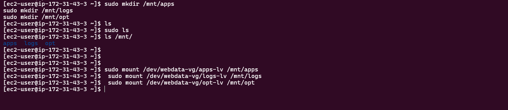

 * Install NFS server, configure it to start on reboot and make sure it is u and running
```
sudo yum -y update
sudo yum install nfs-utils -y
sudo systemctl start nfs-server.service
sudo systemctl enable nfs-server.service
sudo systemctl status nfs-server.service
```
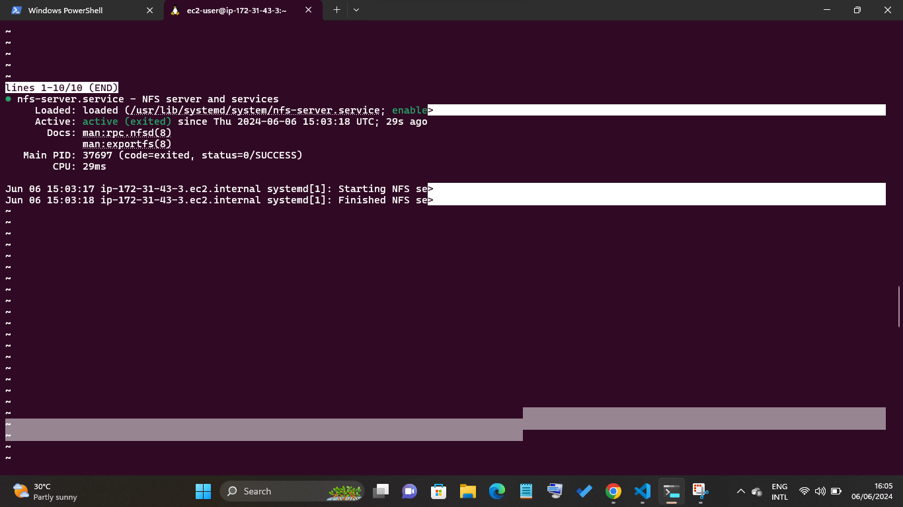
* Export the mounts for webservers' subnet cidr to connect as clients.

**NOTE:** For simplicity, you will install your all three Web Servers inside the same subnet, but in production set up you would probably want to separate each tier inside its own subnet for higher level of security

To check your subnet cidr - open your EC2 details in AWS web console and locate 'Networking' tab and open a Subnet link

* set up permission that will allow our Web servers to read, write and execute files on NFS
```
sudo chown -R nobody: /mnt/apps
sudo chown -R nobody: /mnt/logs
sudo chown -R nobody: /mnt/opt

sudo chmod -R 777 /mnt/apps
sudo chmod -R 777 /mnt/logs
sudo chmod -R 777 /mnt/opt

sudo systemctl restart nfs-server.service
```
to cross check your permision
```
sudo ls -larth /mnt
```
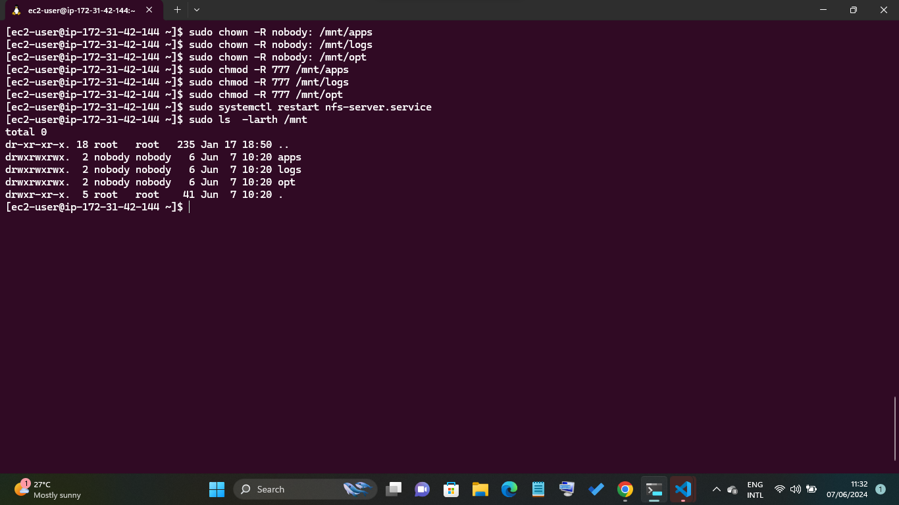
* Configure access to NFS for clients within the same subnet (example of Subnet CIDR - 172.31.32.0/20 )
```
sudo vi /etc/exports

/mnt/apps <Subnet-CIDR>(rw,sync,no_all_squash,no_root_squash)
/mnt/logs <Subnet-CIDR>(rw,sync,no_all_squash,no_root_squash)
/mnt/opt <Subnet-CIDR>(rw,sync,no_all_squash,no_root_squash)

Esc + :wq!

sudo exportfs -arv
```
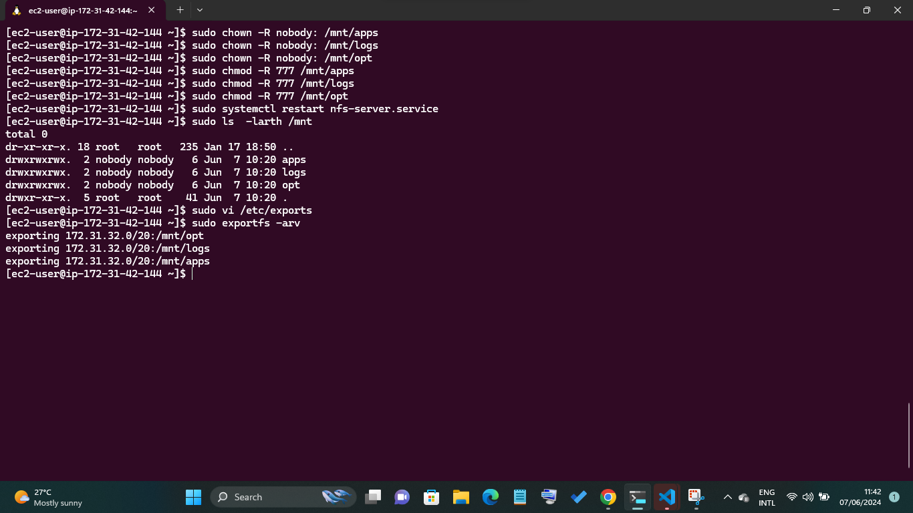
 
 * Check which port is used by NFS and open it using Security Groups (add new Inbound Rule)
```sudo apt 
rpcinfo -p | grep nfs
```
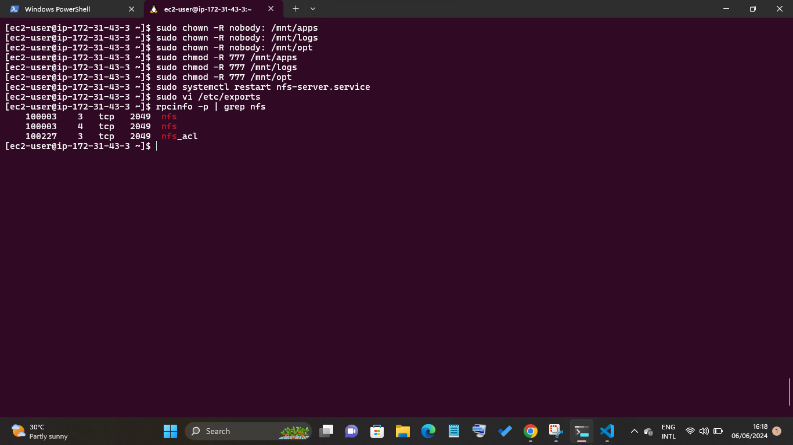
**NOTE:** In order for NFS server to be accessible from your client, you must also open following ports: TCP 111, UDP 111, UDP 2049

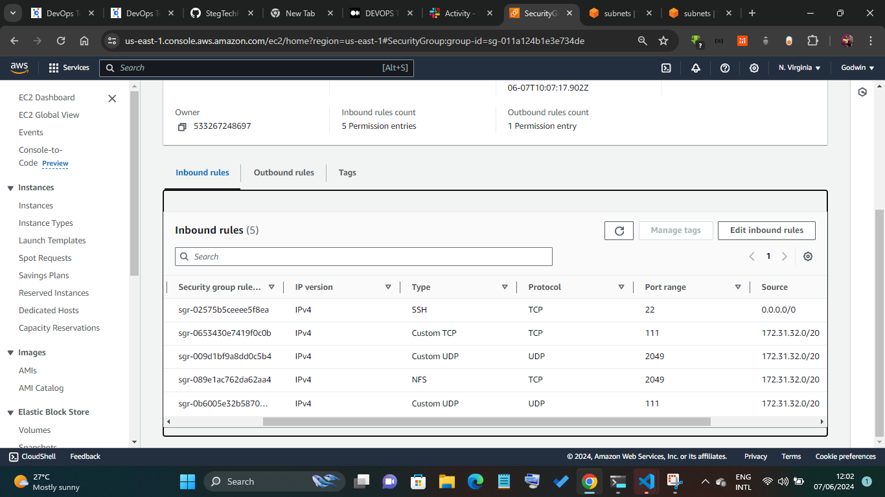

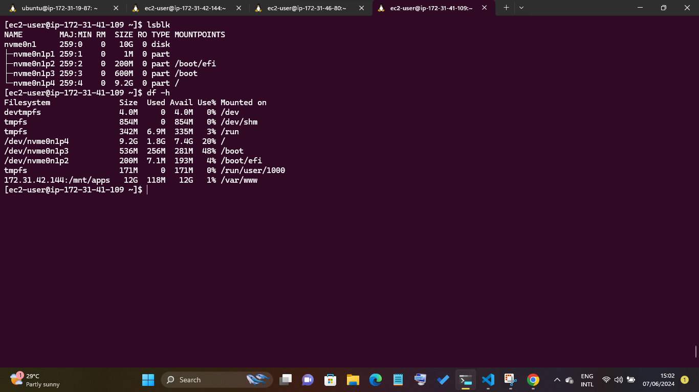
## Step 2 — Configure the database server

* Lunch ubuntu instance, 
* ssh into it
* update and upgreade the instance
* install mysql server in it
  ```
  sudo apt install mysql-server -y
  ```

  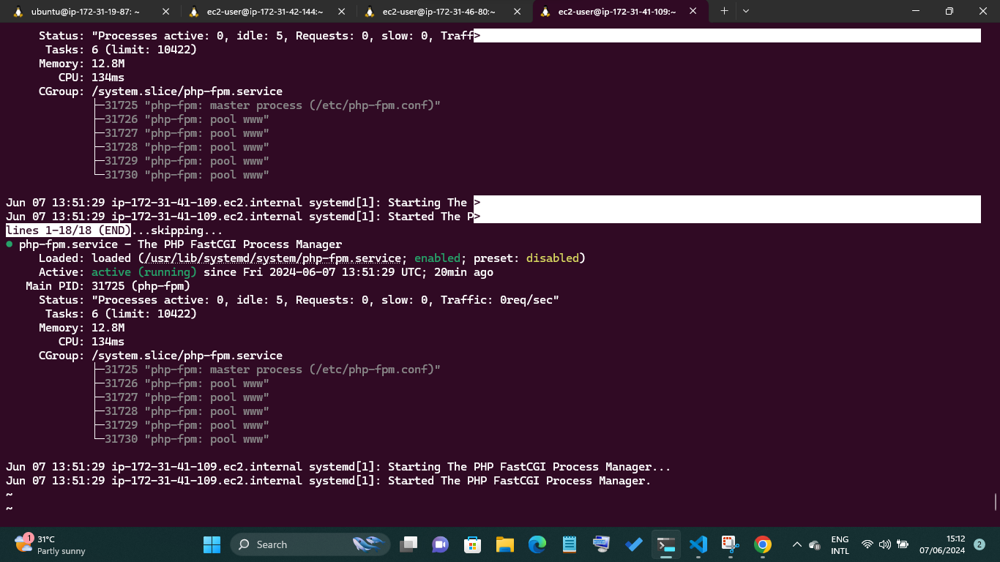
  * configure mysql database
  ```
  sudo mysql
  CREATE DATABASE tooling;
  CREATE USER 'webaccess'@'subnet cidr' IDENTIFIED BY 'password';
  GRANT ALL PRIVILEGES ON tooling.* TO 'webacess'@'subnet cidr';
  exit
  ```
* Edit the MySQL configuration file to bind it to all IP addresses, (0.0.0.0) Open the MySQL configuration file, which is located at /etc/mysql/mysql.conf.d/mysqld.cnf:
* in your ec2 security groud eidit the inbound rules and add the port 3306 (default mysql port) and allow access from your subnet cidr

## Step 3 — Prepare the Web Servers

* We  will lunch 2 ec2 instance this server will be a client to NFS. perferablely Redhat os 
**NOTE:** There can be as many server that will connect to the NFS srver.

* ssh to them
* update and upgrade them
* install NFS client on them.
```
sudo yum install nfs-utils nfs4-acl-tools -y
```

* reate a /var/www/ directory
```
sudo mkdir /var/www
```
* Mount /var/www/ and target the NFS server's export for apps
```
sudo mount -t nfs -o rw,nosuid <NFS-Server-Private-IP-Address>:/mnt/apps /var/www
```

* Verify that NFS was mounted successfully by running df -h. Make sure that the changes will persist on Web Server after reboot:
```
sudo vi /etc/fstab

#add following line

<NFS-Server-Private-IP-Address>:/mnt/apps /var/www nfs defaults 0 0

#save and exit
```

* Install Remi's repository, Apache and PHP


```
sudo yum install git -y

sudo yum install httpd -y

sudo dnf install https://dl.fedoraproject.org/pub/epel/epel-release-latest-9.noarch.rpm -y

sudo dnf install dnf-utils http://rpms.remirepo.net/enterprise/remi-release-9.rpm -y

sudo dnf module reset php -y -y

sudo dnf module enable php:remi-7.4 -y

sudo dnf install php php-opcache php-gd php-curl php-mysqlnd -y -y

sudo systemctl start php-fpm

sudo systemctl enable php-fpm

sudo setsebool -P httpd_execmem 1
```

* Verify that both the webservers /var/www and NFS servers /mnt/apps have the same files and directories:
```
df -h
```

*  Verify that Apache files and directories are available on the Web Server in /var/www and also on the NFS server in /mnt/apps. If you see the same files - it means NFS is mounted correctly. You can try to create a new file touch test.txt from one server and check if the same file is accessible from other Web Servers.
  
* Locate the log folder for Apache on the Web Server and mount it to NFS server's export for logs.
* make /var/log/httpd/ directory
```
sudo mkdir /var/log/httpd
```
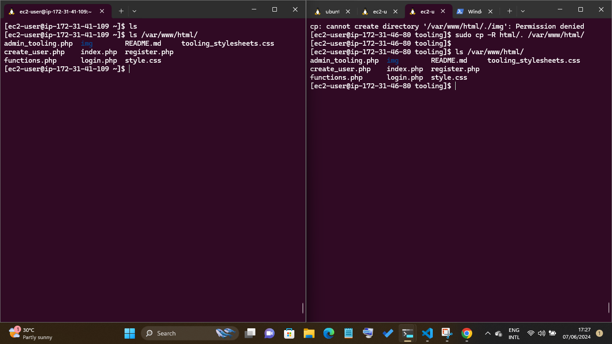
* Mount /var/log/httpd and target the NFS server export for logs
```

```
* To make the changes persist aftr reboot run:
```
sudo vi /etc/fstab

#add the following 

 <nfs-server-ippv4-address>:/mnt/logs  /var/log/httpd nfs defaults 0 0

 #save and exit
```

You can try to create a new file touch test.txt from one server and check if the same file is accessible from other Web Servers

## Step 4: test a remote coonection from webserver

* install connect and show databases and mysql:
```
sudo yum install - mysql

sudo mysql -u weaccess -p -h (mysql server ip address);

show databases;
```

## Step 5: Deploy the tooling website

Fork the tooling website code from my github repository https://github.com/StegTechHub/tooling.git

* install git and clone the repository:
  ```
  sudo yum install git

  git clone https://github.com/citadelict/tooling.git

  ```
   Ensure that the html folder from the repository is deployed to /var/www/html
   
   configure db credentials to connect to the mysql server in functions.php page and import tooling-db.sql file into the database

   ```
       mysql -h 172.31.39.146 -u webserver -p <tooling-db.sql

        sudo mysql -h 172.31.19.87 -u webaccess -p -D tooling < tooling-db.sql
   ```

   Create a new admin user and password, to do this, connect to mysql remotely

```
     sudo mysql -u webaccess -p -h 172.31.39.146
     USE DATABASE tooling;
     INSERT INTO `users` (`id`, `username`, `password`, `email`, `user_type`, `status`) VALUES
      (1, 'myuser', '5f4dcc3b5aa765d61d8327deb882cf99', 'user@mail.com', 'admin', '1');
      exit
```

 restart apache.

 ```
    sudo systemctl restart httpd.service
```

**NOTE:** If you encounter 403 Error - check permissions to your /var/www/html folder and also disable SELinux 

```
      Sudo setsebool -P httpd_can_network_connect=1
```

Allow apache to make outside connection requests

```
      Sudo setsebool -P httpd_can_network_connect=1
```
Restart apache again

vist both webservers ipaddress/index.php on different web broswer tabs


log in using the username : myuser and password : password , which we created earlier

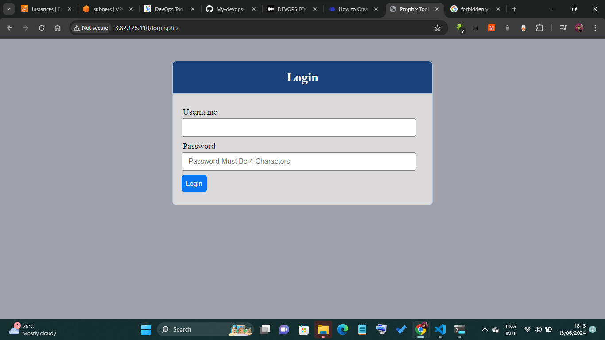

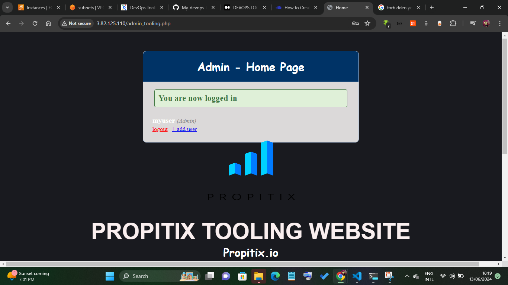

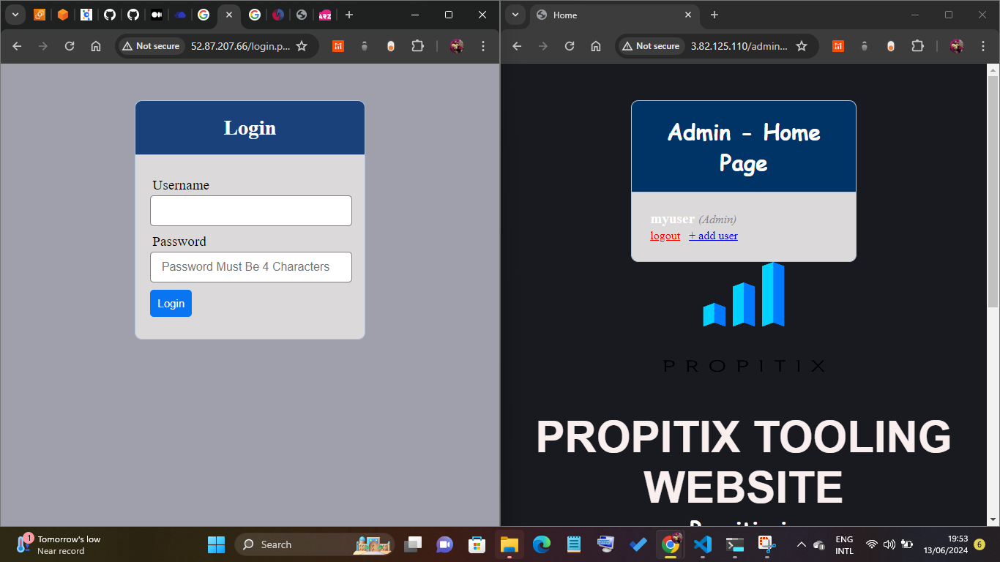