# Load Balancer Solution With Nginx and SSL/TLS

Initally, we look into load balancer with appach, but a devops engineer, we consider Nginx in other to be versatile professional.

It is also extremely important to ensure that connections to your Web solutions are secure and information is encrypted in transit - we will also cover connection over secured HTTP (HTTPS protocol), its purpose and what is required to implement it.

To privent any form of cyber attack we going to be securing our website.

SSL and its newer version, TSL - is a security technology that protects connection from MITM attacks by creating an encrypted session between browser and Web server. Here we will refer this family of cryptographic protocols as SSL/TLS - even though SSL was replaced by TLS, the term is still being widely used.

SSL/TLS uses digital certificates to identify and validate a Website. A browser reads the certificate issued by a Certificate Authority (CA) to make sure that the website is registered in the CA so it can be trusted to establish a secured connection.

In this project we will register our websit LetsEnrcypt Certificate Authority, to automate certificate issuance we will use a shell client recommended by LetsEncrypt - cetrbot.


# Task/Prerquisites

1. Configure Nginx as a Load Balancer
2. Register a new domain name and configure secured connection using SSL/TLS certificates

Our target architecture will look like this:

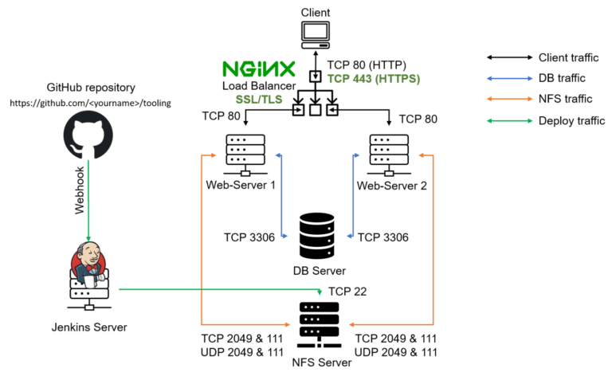

## Part 1 - Configure Nginx As A Load Balancer


We can either uninstall Apache from the existing Load Balancer server or create a fresh installation of Linux for Nginx.

1. Create an EC2 VM based on Ubuntu Server 20.04 LTS and name it Nginx LB (do not forget to open TCP port 80 for HTTP connections, also open TCP port 443 - this port is used for secured HTTPS connections)
2. Update /etc/hosts file for local DNS with Web Servers' names (e.g. Web1 and Web2) and their local IP addresses
3. Install and configure Nginx as a load balancer to point traffic to the resolvable DNS names of the webservers

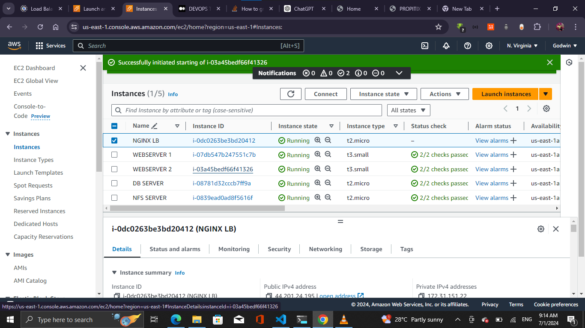

Update the instance and Install Nginx Install Nginx
```
sudo apt update
sudo apt install nginx
```
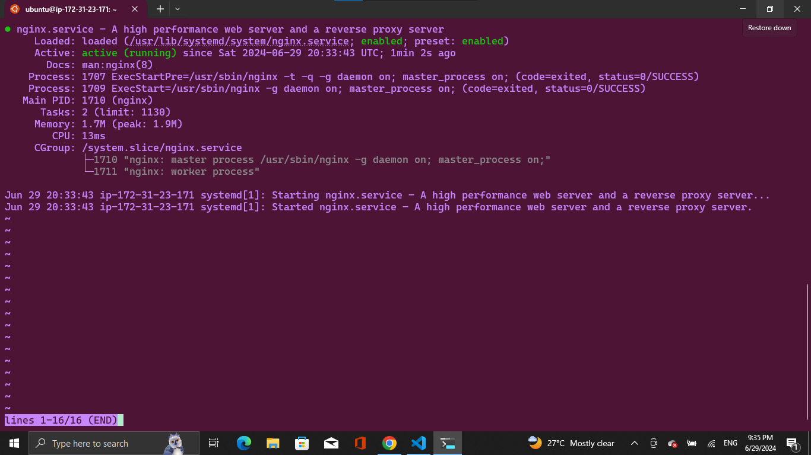

* Configure Nginx LB using Web Servers' names defined in /etc/hosts
* Read this [blog](https://linuxize.com/post/how-to-edit-your-hosts-file/) to understand more about etc/host

```
sudo vi /etc/nginx/nginx.conf

#insert following configuration into http section

 upstream myproject {
    server Web1 weight=5;
    server Web2 weight=5;
  }

server {
    listen 80;
    server_name www.domain.com;
    location / {
      proxy_pass http://myproject;
    }
  }

#comment out this line
#       include /etc/nginx/sites-enabled/*;
```
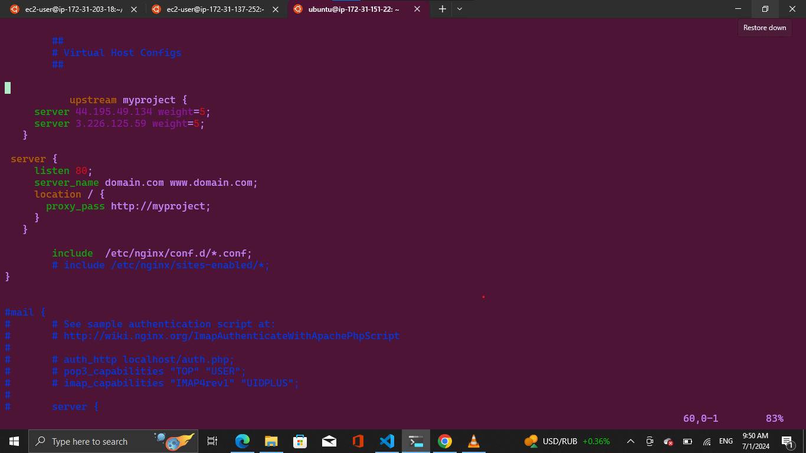


Restart Nginx and make sure the service is up and running

```
sudo systemctl restart nginx
sudo systemctl status nginx
```

## Part 2 - Register a new domain name and configure secured connection using SSL/TLS certificates


### **NOTE:** There are time restart or stop/start your EC2 instance - you get a new public IP address. When you want to associate your domain name - it is better to have a static IP address that does not change after reboot

Therefore you need to set your Elastic IP and associate it with Nginx EC2 server ensure that they are both in the same avalbulity time zone.


Assign an Elastic IP to Nginx LB server and associated domain name with the Elastic IP.

Open the Amazon EC2 console at https://console.aws.amazon.com/ec2/.

In the navigation pane, choose Elastic IPs.

Select the Elastic IP address to associate and choose Actions, Associate Elastic IP address.

For Resource type, choose Instance.

For instance, choose the instance with which to associate the Elastic IP address. You can also enter text to search for a specific instance.

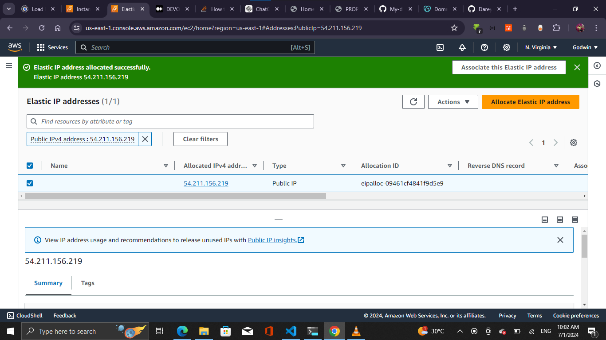

(Optional) For Private IP address, specify a private IP address with which to associate the Elastic IP address.
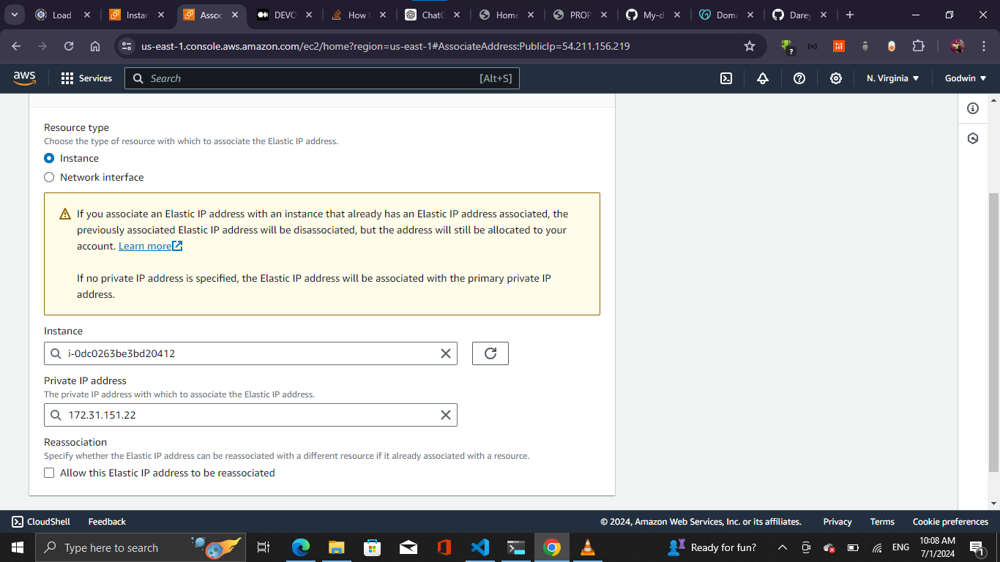

Choose Associate.

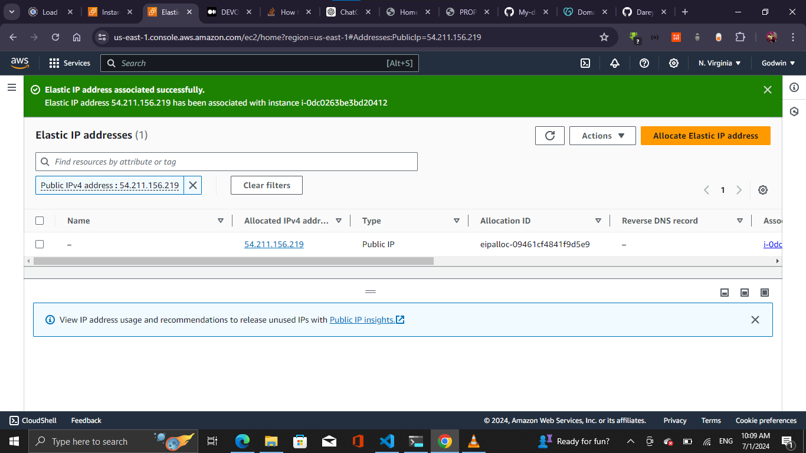


Let us make necessary configurations to make connections to our Tooling Web Solution secured!

In order to get a valid SSL certificate - you need to register a new domain name, you can do it using any  Domain name registrar - a company that manages reservation of domain names. The most popular ones are:

* [Godaddy.com](https://godaddy.com/)
* [Domain.com](https://www.domain.com/), 
* [Bluehost.com](https://www.bluehost.com/).
* [hpanel.hostinger](https://hpanel.hostinger.com/).

1. Register a new domain name with any registrar of your choice in any domain zone (e.g. .com, .net, .org, .edu, .info, .xyz or any other)
2. Assign an Elastic IP to your Nginx LB server and associate your domain name with this Elastic IP


3. Update A record in your registrar to point to Nginx LB using Elastic IP address

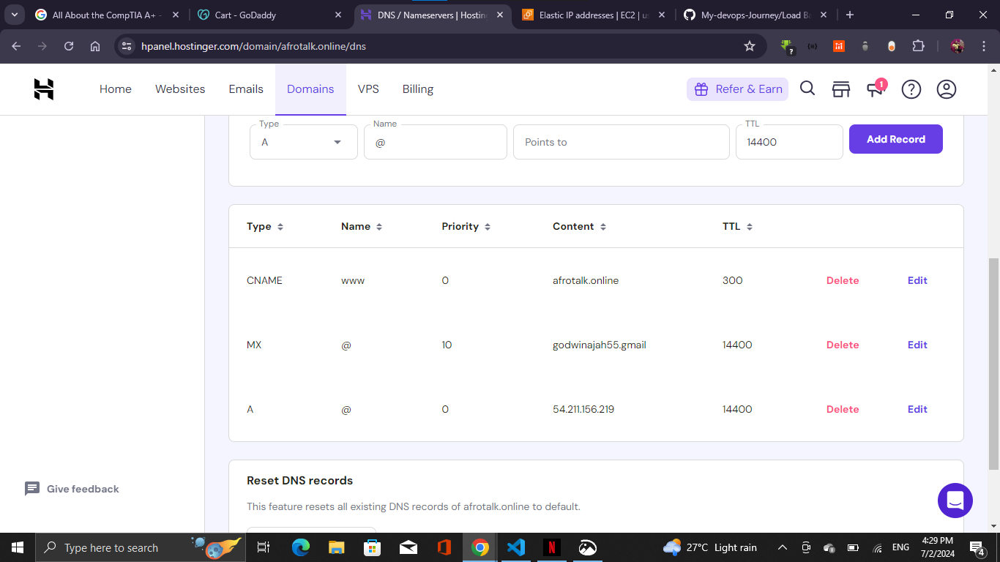
Visit a website like 'https://dnschecker.org/' and confirm if indeed the domain name is already pointing to the ip address via the a records

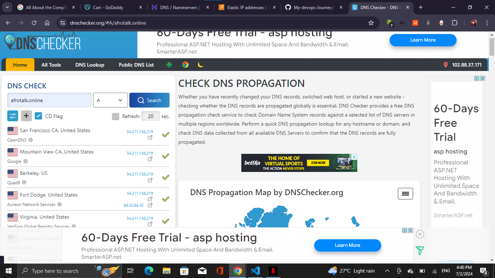
Check that your Web Servers can be reached from your browser using new domain name using HTTP protocol - http://<your-domain-name.com>


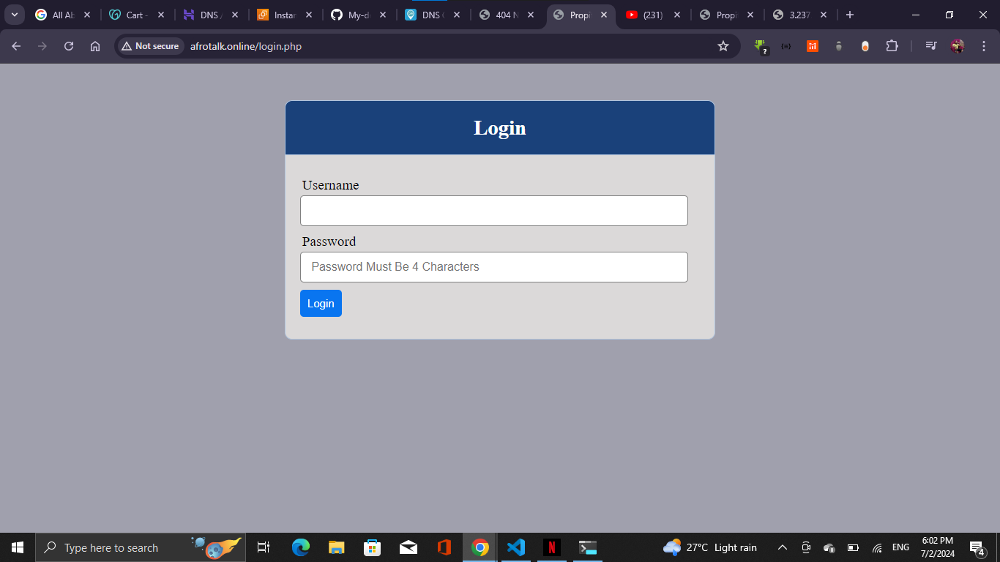
1. Configure Nginx to recognize your new domain name

Update your nginx.conf with server_name www.<your-domain-name.com> instead of server_name www.domain.com

5. Install certbot and request for an SSL/TLS certificate

Make sure snapd service is active and running

```
sudo systemctl status snapd
```
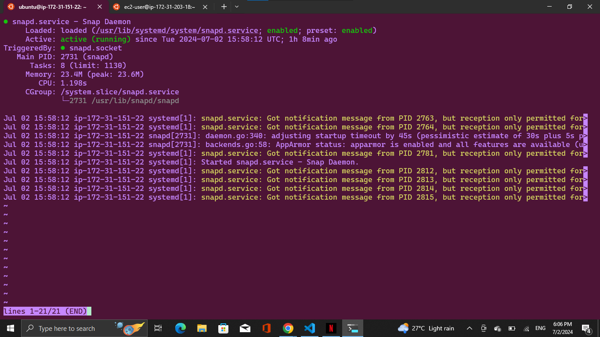


Install certbot

```
sudo snap install --classic certbot
```


Request your certificate (just follow the certbot instructions -wewill need to choose which domain you want your certificate to be issued for, domain name will be looked up from nginx.conf file so make sure you have updated it on step 4).

```
sudo ln -s /snap/bin/certbot /usr/bin/certbot
sudo certbot --nginx
```

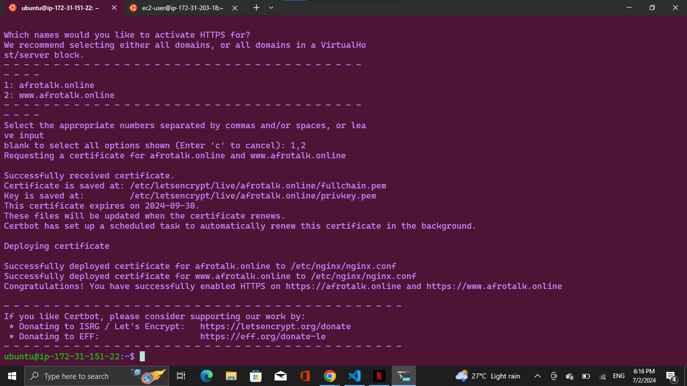

Test secured access to your Web Solution by trying to reach https://<your-domain-name.com>

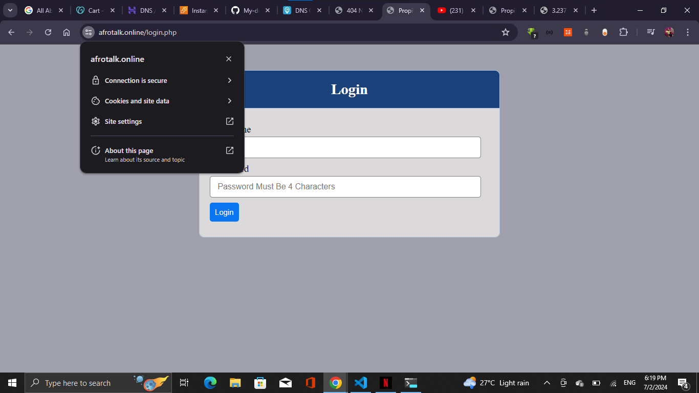


You shall be able to access your website by using HTTPS protocol (that uses TCP port 443) and see a padlock pictogram in your browser's search string. Click on the padlock icon and you can see the details of the certificate issued for your website.

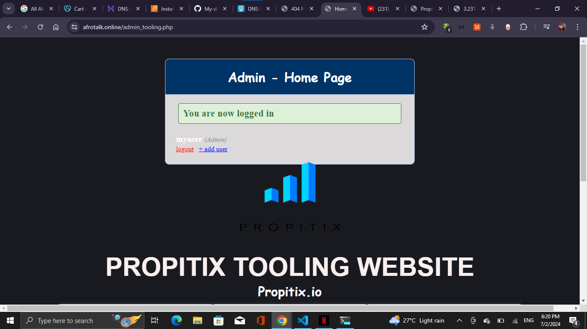

6. Set up periodical renewal of your SSL/TLS certificate

By default, LetsEncrypt certificate is valid for 90 days, so it is recommended to renew it at least every 60 days or more frequently.

You can test renewal command in dry-run mode

```
sudo certbot renew --dry-run
```
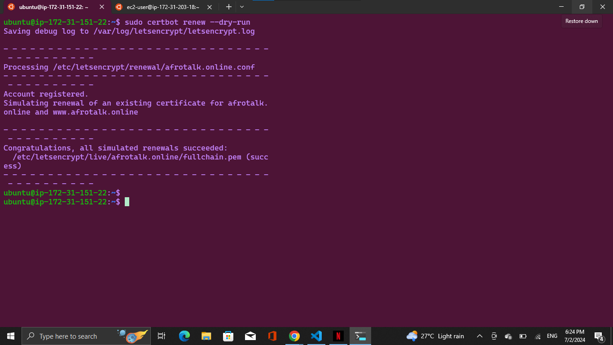

Best pracice is to have a scheduled job that to run renew command periodically. Let us configure a cronjob to run the command twice a day.

To do so, lets edit the crontab file with the following command:

```
crontab -e
```
Add following line:

```
* */12 * * *   root /usr/bin/certbot renew > /dev/null 2>&1
```
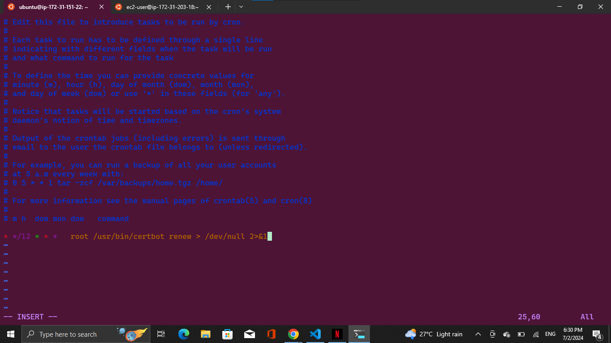

You can always change the interval of this cronjob if twice a day is too often by adjusting schedule expression.


## we have successfully create our nginx load balancer and hosting our domain to make our websit more secure.
