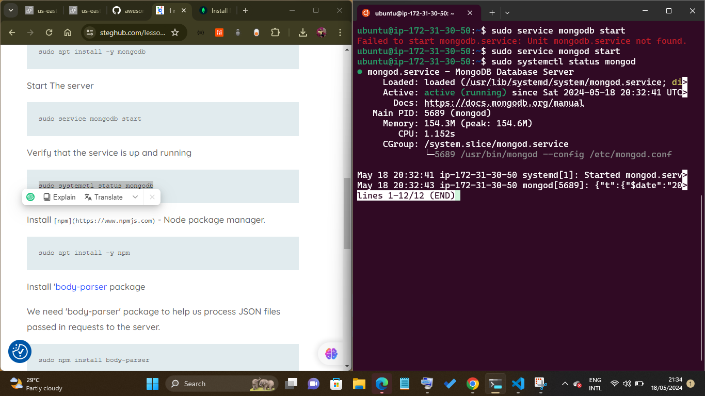

# MEAN Stack Deployment to Ubuntu in AWS- 103


## Step 2: Install MongoDB

ongoDB stores data in flexible, JSON-like documents. Fields in a database can vary from document to document and data structure can be changed over time. For our example application, we are adding book records to MongoDB that contain book name, isbn number, author, and number of pages.

```
sudo apt-key adv --keyserver hkp://keyserver.ubuntu.com:80 --recv 0C49F3730359A14518585931BC711F9BA15703C6
```

```
echo "deb [ arch=amd64 ] https://repo.mongodb.org/apt/ubuntu trusty/mongodb-org/3.4 multiverse" | sudo tee /etc/apt/sources.list.d/mongodb-org-3.4.list
```

Install MongoDB

```
sudo apt install -y mongodb
```
install i was exprence error while installing mongodb but i have to do the following.


From a terminal, install gnupg and curl if they are not already available:
```
sudo apt-get install gnupg curl
```
Create a list file for MongoDB
Create the list file /etc/apt/sources.list.d/mongodb-org-7.0.list for your version of Ubuntu.

Create the /etc/apt/sources.list.d/mongodb-org-7.0.list file for Ubuntu 22.04 (Jammy):

```
echo "deb [ arch=amd64,arm64 signed-by=/usr/share/keyrings/mongodb-server-7.0.gpg ] https://repo.mongodb.org/apt/ubuntu jammy/mongodb-org/7.0 multiverse" | sudo tee /etc/apt/sources.list.d/mongodb-org-7.0.list
```
Reload local package database
Issue the following command to reload the local package database:

```
sudo apt-get update
```

Install the MongoDB packages
You can install either the latest stable version of MongoDB or a specific version of MongoDB.

To install the latest stable version, issue the following

```
sudo apt-get install -y mongodb-org
```

Start The server

```
sudo service mongodb start
```

Verify that the service is up and running

```
sudo systemctl status mongodb
```



Install [npm](https://www.npmjs.com) - Node package manager.


```
sudo apt install -y npm
```

Install ['body-parser](https://www.npmjs.com/package/)
body-parser package

We need 'body-parser' package to help us process JSON files passed in requests to the server.


```
sudo npm install body-parser
```

Create a folder named 'Books'

```
mkdir Books && cd Books
```

In the Books directory, Initialize npm project

```
npm init
```
Add a file to it named server.js

```
vi server.js
```

Copy and paste the web server code below into the server.js file.

```
var express = require('express');
var bodyParser = require('body-parser');
var app = express();
app.use(express.static(__dirname + '/public'));
app.use(bodyParser.json());
require('./apps/routes')(app);
app.set('port', 3300);
app.listen(app.get('port'), function() {
    console.log('Server up: http://localhost:' + app.get('port'));
});
```

