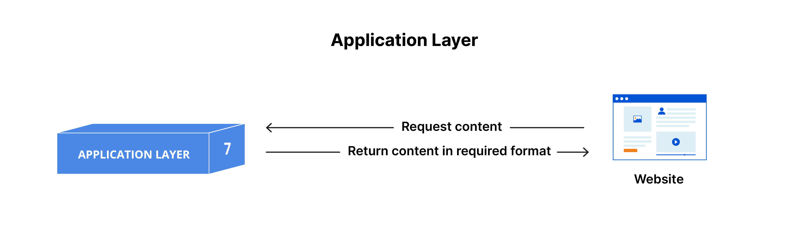
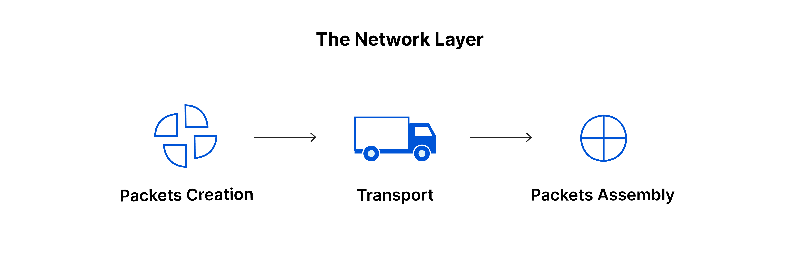
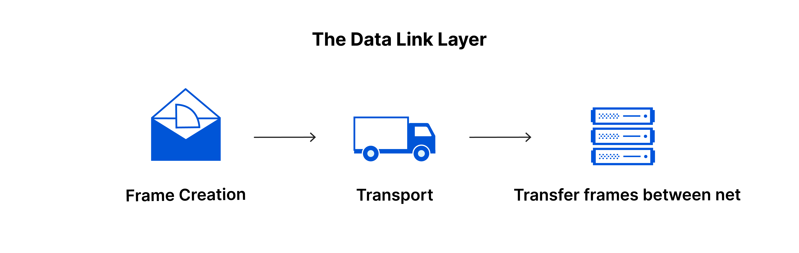
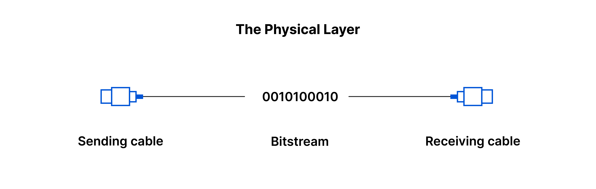
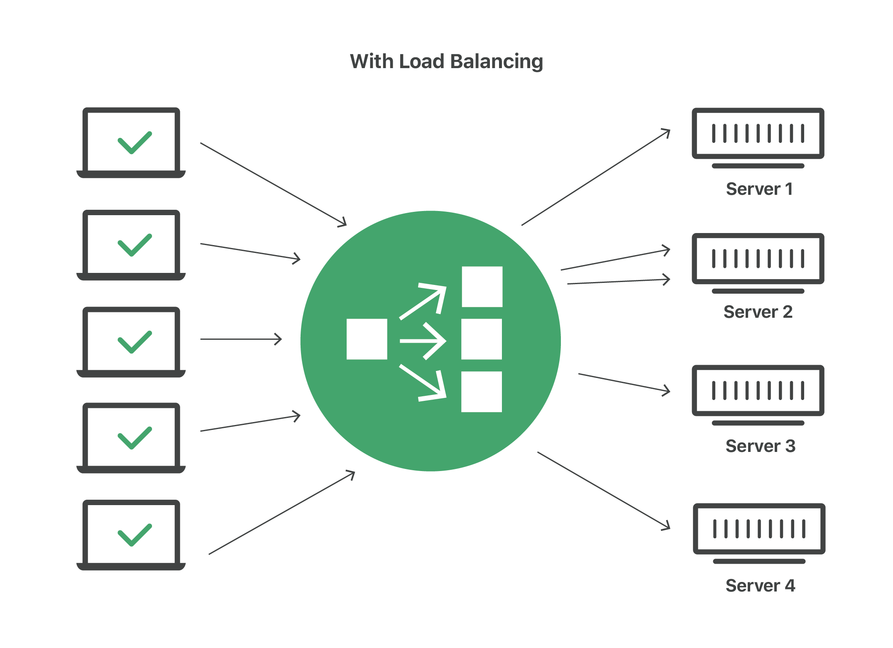

# AM LOOKING INTO THE FOLLOWING TO ENABLE ME GAIN MORE UNDERSANDING ABOUT MEAN STACK

1. Refresh your knowledge of OSI model
2. Read about Load Balancing, get yourself familiar with different types and techniques of traffic load balancing.
3. Practice in editing simple web forms with HTML + CSS + JS

It is inportant to note that MEAN stack is a combination of the following components.

* MongoDB (Document database) - Stores and allows to retrieve data etrieve data.
* Express (Back-end application framework) - Makes requests to Database for Reads and Writes.
* Angular (Front-end application framework) - Handles Client and Server Requests
* Node.js (JavaScript runtime environment) - Accepts requests and displays results to end user

## OSI MODEL
The open systems interconnection (OSI) model is a conceptual model created by the International Organization for Standardization which enables diverse communication systems to communicate using standard protocols. In plain English, the OSI provides a standard for different computer systems to be able to communicate with each other.

The OSI Model can be seen as a universal language for computer networking. It is based on the concept of splitting up a communication system into seven abstract layers, each one stacked upon the last.

Each layer of the OSI Model handles a specific job and communicates with the layers above and below itself. DDoS attacks target specific layers of a network connection; application layer attacks target layer 7 and protocol layer attacks target layers 3 and 4.

### Important of OSI Model

Although the modern Internet does not strictly follow the OSI Model (it more closely follows the simpler Internet protocol suite), the OSI Model is still very useful for troubleshooting network problems. Whether it’s one person who can’t get their laptop on the Internet, or a website being down for thousands of users, the OSI Model can help to break down the problem and isolate the source of the trouble. If the problem can be narrowed down to one specific layer of the model, a lot of unnecessary work can be avoided.

### The 7 layers of OSI Model

The seven abstraction layers of the OSI model can be defined as follows, from top to bottom:

7. The application layer
   

This is the only layer that directly interacts with data from the user. Software applications like web browsers and email clients rely on the application layer to initiate communications. But it should be made clear that client software applications are not part of the application layer; rather the application layer is responsible for the protocols and data manipulation that the software relies on to present meaningful data to the user.

Application layer protocols include HTTP as well as SMTP (Simple Mail Transfer Protocol is one of the protocols that enables email communications).

6. The presentation layer

This layer is primarily responsible for preparing data so that it can be used by the application layer; in other words, layer 6 makes the data presentable for applications to consume. The presentation layer is responsible for translation, encryption, and compression of data.

Two communicating devices communicating may be using different encoding methods, so layer 6 is responsible for translating incoming data into a syntax that the application layer of the receiving device can understand.

If the devices are communicating over an encrypted connection, layer 6 is responsible for adding the encryption on the sender’s end as well as decoding the encryption on the receiver's end so that it can present the application layer with unencrypted, readable data.

Finally the presentation layer is also responsible for compressing data it receives from the application layer before delivering it to layer 5. This helps improve the speed and efficiency of communication by minimizing the amount of data that will be transferred.

5. The session layer

 

 This is the layer responsible for opening and closing communication between the two devices. The time between when the communication is opened and closed is known as the session. The session layer ensures that the session stays open long enough to transfer all the data being exchanged, and then promptly closes the session in order to avoid wasting resources.
 
 The session layer also synchronizes data transfer with checkpoints. For example, if a 100 megabyte file is being transferred, the session layer could set a checkpoint every 5 megabytes. In the case of a disconnect or a crash after 52 megabytes have been transferred, the session could be resumed from the last checkpoint, meaning only 50 more megabytes of data need to be transferred. Without the checkpoints, the entire transfer would have to begin again from scratch.

 4. The transport layer

Layer 4 is responsible for end-to-end communication between the two devices. This includes taking data from the session layer and breaking it up into chunks called segments before sending it to layer 3. The transport layer on the receiving device is responsible for reassembling the segments into data the session layer can consume.

The transport layer is also responsible for flow control and error control. Flow control determines an optimal speed of transmission to ensure that a sender with a fast connection does not overwhelm a receiver with a slow connection. The transport layer performs error control on the receiving end by ensuring that the data received is complete, and requesting a retransmission if it isn’t.

3. The network layer

The network layer is responsible for facilitating data transfer between two different networks. If the two devices communicating are on the same network, then the network layer is unnecessary. The network layer breaks up segments from the transport layer into smaller units, called packets, on the sender’s device, and reassembling these packets on the receiving device. The network layer also finds the best physical path for the data to reach its destination; this is known as routing.

Network layer protocols include IP, the Internet Control Message Protocol (ICMP), the Internet Group Message Protocol (IGMP), and the IPsec suite.

2. The data link layer

The data link layer is very similar to the network layer, except the data link layer facilitates data transfer between two devices on the same network. The data link layer takes packets from the network layer and breaks them into smaller pieces called frames. Like the network layer, the data link layer is also responsible for flow control and error control in intra-network communication (The transport layer only does flow control and error control for inter-network communications).

1. The physical layer

This layer includes the physical equipment involved in the data transfer, such as the cables and switches. This is also the layer where the data gets converted into a bit stream, which is a string of 1s and 0s. The physical layer of both devices must also agree on a signal convention so that the 1s can be distinguished from the 0s on both devices.

### How data flows through the OSI Model

In order for human-readable information to be transferred over a network from one device to another, the data must travel down the seven layers of the OSI Model on the sending device and then travel up the seven layers on the receiving end.

For example: Mr. Cooper wants to send Ms. Palmer an email. Mr. Cooper composes his message in an email application on his laptop and then hits ‘send’. His email application will pass his email message over to the application layer, which will pick a protocol (SMTP) and pass the data along to the presentation layer. The presentation layer will then compress the data and then it will hit the session layer, which will initialize the communication session.

The data will then hit the sender’s transportation layer where it will be segmented, then those segments will be broken up into packets at the network layer, which will be broken down even further into frames at the data link layer. The data link layer will then deliver those frames to the physical layer, which will convert the data into a bitstream of 1s and 0s and send it through a physical medium, such as a cable.

Once Ms. Palmer’s computer receives the bit stream through a physical medium (such as her wifi), the data will flow through the same series of layers on her device, but in the opposite order. First the physical layer will convert the bitstream from 1s and 0s into frames that get passed to the data link layer. The data link layer will then reassemble the frames into packets for the network layer. The network layer will then make segments out of the packets for the transport layer, which will reassemble the segments into one piece of data.

The data will then flow into the receiver's session layer, which will pass the data along to the presentation layer and then end the communication session. The presentation layer will then remove the compression and pass the raw data up to the application layer. The application layer will then feed the human-readable data along to Ms. Palmer’s email software, which will allow her to read Mr. Cooper’s email on her laptop screen.

# LOAD BALANCING

Load balancing is the practice of distributing computational workloads between two or more computers. On the Internet, load balancing is often employed to divide network traffic among several servers. This reduces the strain on each server and makes the servers more efficient, speeding up performance and reducing latency. Load balancing is essential for most Internet applications to function properly.

Imagine a checkout line at a grocery store with 8 checkout lines, only one of which is open. All customers must get into the same line, and therefore it takes a long time for a customer to finish paying for their groceries. Now imagine that the store instead opens all 8 checkout lines. In this case, the wait time for customers is about 8 times shorter (depending on factors like how much food each customer is buying).

Load balancing essentially accomplishes the same thing. By dividing user requests among multiple servers, user wait time is vastly cut down. This results in a better user experience — the grocery store customers in the example above would probably look for a more efficient grocery store if they always experienced long wait times.

### How does load balancing work?

Load balancing is handled by a tool or application called a load balancer. A load balancer can be either hardware-based or software-based. Hardware load balancers require the installation of a dedicated load balancing device; software-based load balancers can run on a server, on a virtual machine, or in the cloud. Content delivery networks (CDN) often include load balancing features.

When a request arrives from a user, the load balancer assigns the request to a given server, and this process repeats for each request. Load balancers determine which server should handle each request based on a number of different algorithms. These algorithms fall into two main categories: **static and dynamic.**

#### Static load balancing algorithms

Static load balancing algorithms distribute workloads without taking into account the current state of the system. A static load balancer will not be aware of which servers are performing slowly and which servers are not being used enough. Instead it assigns workloads based on a predetermined plan. Static load balancing is quick to set up, but can result in inefficiencies.

Referring back to the analogy above, imagine if the grocery store with 8 open checkout lines has an employee whose job it is to direct customers into the lines. Imagine this employee simply goes in order, assigning the first customer to line 1, the second customer to line 2, and so on, without looking back to see how quickly the lines are moving. If the 8 cashiers all perform efficiently, this system will work fine — but if one or more is lagging behind, some lines may become far longer than others, resulting in bad customer experiences. Static load balancing presents the same risk: sometimes, individual servers can still become overburdened.

Round robin DNS and client-side random load balancing are two common forms of static load balancing.

#### Dynamic load balancing algorithms

Dynamic load balancing algorithms take the current availability, workload, and health of each server into account. They can shift traffic from overburdened or poorly performing servers to underutilized servers, keeping the distribution even and efficient. However, dynamic load balancing is more difficult to configure. A number of different factors play into server availability: the health and overall capacity of each server, the size of the tasks being distributed, and so on.

Suppose the grocery store employee who sorts the customers into checkout lines uses a more dynamic approach: the employee watches the lines carefully, sees which are moving the fastest, observes how many groceries each customer is purchasing, and assigns the customers accordingly. This may ensure a more efficient experience for all customers, but it also puts a greater strain on the line-sorting employee.

There are several types of dynamic load balancing algorithms, including least connection, weighted least connection, resource-based, and geolocation-based load balancing.

### Where load balancing can be used

As discussed above, load balancing is often used with web applications. Software-based and cloud-based load balancers help distribute Internet traffic evenly between servers that host the application. Some cloud load balancing products can balance Internet traffic loads across servers that are spread out around the world, a process known as global server load balancing (GSLB).

Load balancing is also commonly used within large localized networks, like those within a data center or a large office complex. Traditionally, this has required the use of hardware appliances such as an application delivery controller (ADC) or a dedicated load balancing device. Software-based load balancers are also used for this purpose.

## load balancing algorithm

A load balancer is a software or hardware device that keeps any one server from becoming overloaded. A load balancing algorithm is the logic that a load balancer uses to distribute network traffic between servers (an algorithm is a set of predefined rules).

There are two primary approaches to load balancing. Dynamic load balancing uses algorithms that take into account the current state of each server and distribute traffic accordingly. Static load balancing distributes traffic without making these adjustments. Some static algorithms send an equal amount of traffic to each server in a group, either in a specified order or at random.

### the different types of load balancing algorithms

**Dynamic load balancing algorithms**

* *Least connection*: Checks which servers have the fewest connections open at the time and sends traffic to those servers. This assumes all connections require roughly equal processing power.
Weighted least 

* *connection*: Gives administrators the ability to assign different weights to each server, assuming that some servers can handle more connections than others.
  

*Weighted response time*: Averages the response time of each server, and combines that with the number of connections each server has open to determine where to send traffic. By sending traffic to the servers with the quickest response time, the algorithm ensures faster service for users.

*Resource-based*: Distributes load based on what resources each server has available at the time. Specialized software (called an "agent") running on each server measures that server's available CPU and memory, and the load balancer queries the agent before distributing traffic to that server.

**Static load balancing algorithms**

* *Round robin*: Round robin load balancing distributes traffic to a list of servers in rotation using the Domain Name System (DNS). An authoritative nameserver will have a list of different A records for a domain and provides a different one in response to each DNS query.

* *Weighted round robin*: Allows an administrator to assign different weights to each server. Servers deemed able to handle more traffic will receive slightly more. Weighting can be configured within DNS records.

* *IP hash*: Combines incoming traffic's source and destination IP addresses and uses a mathematical function to convert it into a hash. Based on the hash, the connection is assigned to a specific server.