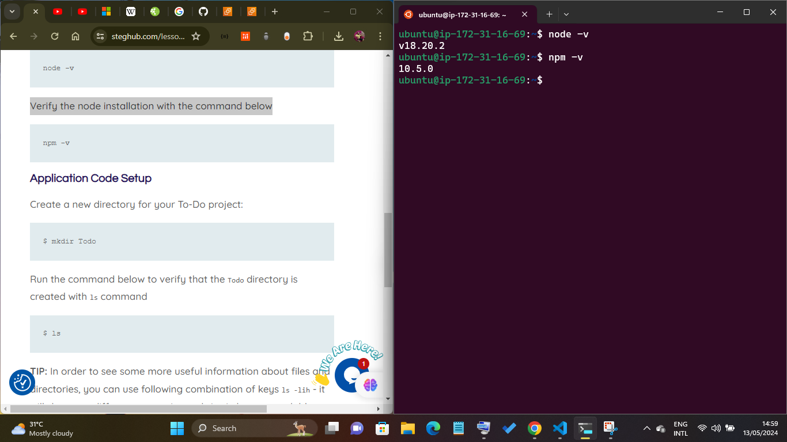

# Step 1 - Backend configuration

Update ubuntu

```
sudo apt update
```

Upgrade ubuntu

```
sudo apt upgrade
```

Lets get the location of Node.js software from Ubuntu repositories.

```
curl -fsSL https://deb.nodesource.com/setup_18.x | sudo -E bash -
```


## Install Node.js on the server

Install Node.js with the command below

```
sudo apt-get install -y nodejs
```

It is important to note that the command above will install **node.js and npm**. npm is a package installer just like apt is to ubuntu.

Verify the node installation with the command below

```
node -v
```

Verify the node installation with the command below

```
npm -v
```




## Application Code Setup

Create a new directory for your To-Do project:

```
$ mkdir Todo
```

Run the command below to verify that the Todo directory is created with ls command

```
$ ls
```

* **Note** In order to see some more useful information about files and directories, you can use following combination of keys ls -lih - it will show you different properties and size in human readable format. You can learn more about different useful keys for ls command with ls --help.

Now change your current directory to the newly created one:

```
$ cd Todo
```

Next, you will use the command npm init to initialise your project, so that a new file named package.json will be created. This file will normally contain information about your application and the dependencies that it needs to run. Follow the prompts after running the command. You can press Enter several times to accept default values, then accept to write out the package.json file by typing yes.

Run the command ls to confirm that you have package.json file created.

