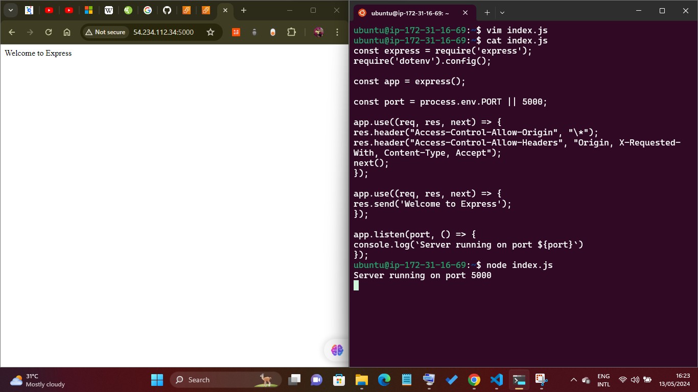
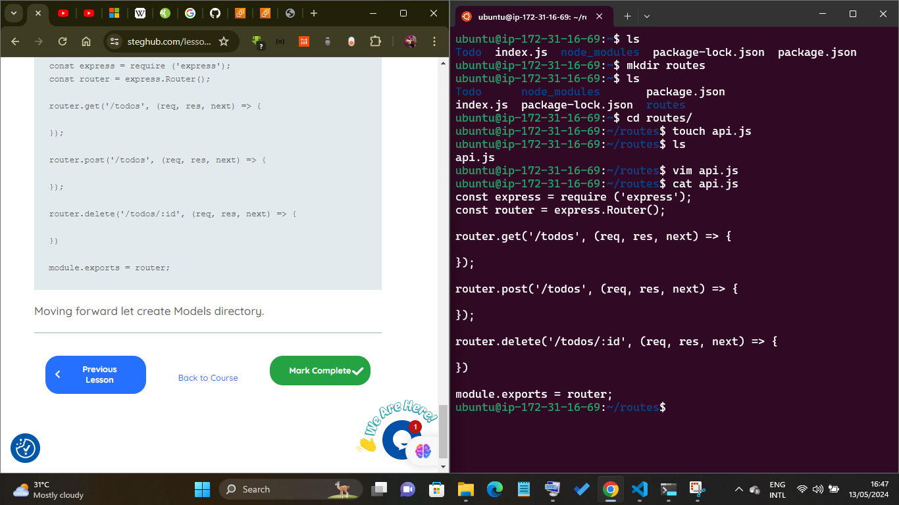

# MERN Web Stack- 103

## Install ExpressJS

Remember that Express is a framework for Node.js, therefore a lot of things developers would have programmed is already taken care of out of the box. Therefore it simplifies development, and abstracts a lot of low level details. For example, Express helps to define routes of your application based on HTTP methods and URLs.

To use express, install it using npm:

```
$ npm install express
```

Now create a file index.js with the command below

```
$ touch index.js
```

Run ls to confirm that your index.js file is successfully created

Install the dotenv module

```
npm install dotenv
```

Open the index.js file with the command below

```
$ vim index.js
```

Type the code below into it and save. Do not get overwhelmed by the code you see. For now, simply paste the code into the file.

```
const express = require('express');
require('dotenv').config();

const app = express();

const port = process.env.PORT || 5000;

app.use((req, res, next) => {
res.header("Access-Control-Allow-Origin", "\*");
res.header("Access-Control-Allow-Headers", "Origin, X-Requested-With, Content-Type, Accept");
next();
});

app.use((req, res, next) => {
res.send('Welcome to Express');
});

app.listen(port, () => {
console.log(`Server running on port ${port}`)
});
```

Notice that we have specified to use port 5000 in the code. This will be required later when we go on the browser.

Use :w to save in vim and use :qa to exit vim

Now it is time to start our server to see if it works. Open your terminal in the same directory as your index.js file and type

```
$ node index.js
```

If every thing goes well, you should see Server running on port 5000 in your terminal.

Open up your browser and try to access your server's Public IP or Public DNS name followed by port 5000:

```
http://<PublicIP-or-PublicDNS>:5000
```





Quick reminder how to get your server's Public IP and public DNS name:

You can find it in your AWS web console in EC2 details
* Run curl -s http://169.254.169.254/latest/meta-data/public-ipv4 for Public IP address
*   or curl -s http://169.254.169.254/latest/meta-data/public-hostname for Public DNS name.
  

## Routes

There are three actions that our To-Do application needs to be able to do:

1. Create a new task
2. Display list of all tasks
3. Delete a completed task


Each task will be associated with some particular endpoint and will use different standard HTTP request methods: POST, GET, DELETE.

For each task, we need to create routes that will define various endpoints that the To-do app will depend on. So let us create a folder routes


```
mkdir routes
```

 **NOTE:** You can open multiple shells in Putty or Linux/Mac to connect to the same EC2

Change directory to routes folder.

```
cd routes
```

Now, create a file api.js with the command below

```
touch api.js
```

Open the file with the command below

```
vim api.js
```

Copy below code in the file

```
const express = require ('express');
const router = express.Router();

router.get('/todos', (req, res, next) => {

});

router.post('/todos', (req, res, next) => {

});

router.delete('/todos/:id', (req, res, next) => {

})

module.exports = router;
```


