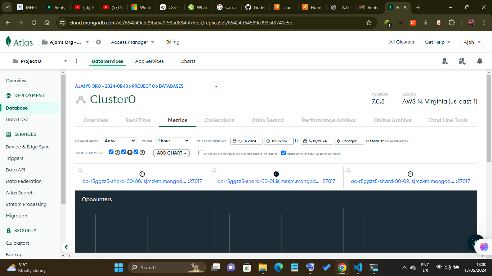
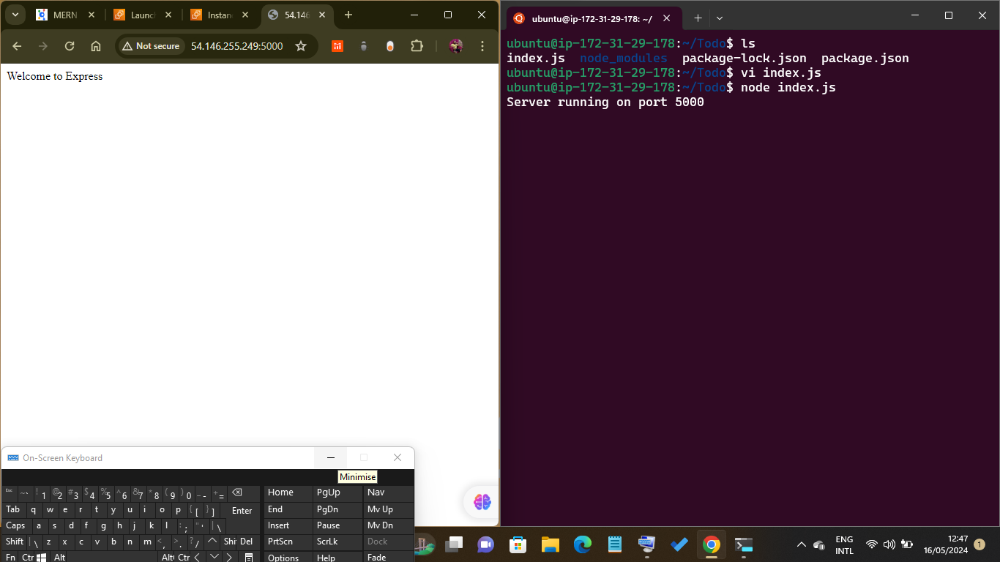

# MERN Web Stack- 105

## MongoDB Database

We need a database where we will store our data. For this we will make use of mLab. mLab provides MongoDB database as a service solution (DBaaS), so to make life easy, you will need to sign up for a shared clusters free account, which is ideal for our use case. Sign up here. Follow the sign up process, select AWS as the cloud provider, and choose a region near you.

Allow access to the MongoDB database from anywhere (Not secure, but it is ideal for testing)


make sure you change the time of deleting the entry from 6 Hours to 1 Week

Create a MongoDB database and collection inside mLab




In the index.js file, we specified process.env to access environment variables, but we have not yet created this file. So we need to do that now.

Create a file in your Todo directory and name it .env.

```
touch .env
vi .env
```

Add the connection string to access the database in it, just as below:

```
DB = 'mongodb+srv://<username>:<password>@<network-address>/<dbname>?retryWrites=true&w=majority'
```


Ensure to update ``<username>, <password>, <network-address> and <database> ``according to your setup

Now we need to update the index.js to reflect the use of .env so that Node.js can connect to the database.

Simply delete existing content in the file, and update it with the entire code below.

To do that using vim, follow below steps

Open the file with vim index.js
* Press esc
* Type :
* Type %d
* Hit 'Enter'
  
The entire content will be deleted, then,

* Press i to enter the insert mode in vim
* Now, paste the entire code below in the file.

```
const express = require('express');
const bodyParser = require('body-parser');
const mongoose = require('mongoose');
const routes = require('./routes/api');
const path = require('path');
require('dotenv').config();

const app = express();

const port = process.env.PORT || 5000;

//connect to the database
mongoose.connect(process.env.DB, { useNewUrlParser: true, useUnifiedTopology: true })
.then(() => console.log(`Database connected successfully`))
.catch(err => console.log(err));

//since mongoose promise is depreciated, we overide it with node's promise
mongoose.Promise = global.Promise;

app.use((req, res, next) => {
res.header("Access-Control-Allow-Origin", "\*");
res.header("Access-Control-Allow-Headers", "Origin, X-Requested-With, Content-Type, Accept");
next();
});

app.use(bodyParser.json());

app.use('/api', routes);

app.use((err, req, res, next) => {
console.log(err);
next();
});

app.listen(port, () => {
console.log(`Server running on port ${port}`)
});
```

Using environment variables to store information is considered more secure and best practice to separate configuration and secret data from the application, instead of writing connection strings directly inside the index.js application file.

Start your server using the command:

```
node index.js
```

You shall see a message **Database connected successfully**

)


