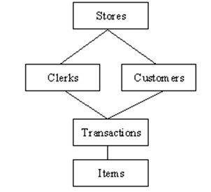

# DATABASE MANAGEMENT SYSTEM

A database is a collection of data or records. Database management systems are designed to manage databases. A database management system (DBMS) is a software system that uses a standard method to store and organize data. The data can be added, updated, deleted, or traversed using standard algorithms and queries.

## Types of Database Management Systems

Seven most common types of Database include:

1. Hierarchical database
2. Network database
3. Relational databases
4. Graph databases
5. ER model databases
6. Document databases
7. Object-oriented databases
8. NoSQL databases

### Hierarchical Databases

Data is stored in a parent-children relationship node in a hierarchical database management system (hierarchical DBMS) Model. In a hierarchical database, besides actual data, records also contain information about their groups of parent/child relationships

The hierarchical database model is organized into tree-like structure. The data is stored in the form of collection of field where each field carries one spacific value.

To retrive each data we need to go through the tree untill the data is found.

This database is use to build a high-performace application usually in banking and telecommunications industry.

 

Below is an example of Hierarchical database

Advantages of Hierarchical Database 

A hierarchical database can be accessed and updated rapidly. As shown in the figure above, its model structure is like a tree, and the relationships between records are defined in advance. This feature is a double-edged sword.

Disadvantages of a Hierarchical Database

This type of database structure means that each child in the tree may have only one parent. Relationships or linkages between children are not permitted, even if they make sense from a logical standpoint. Adding a new field or record requires that the entire database be redefined. Hierarchical databases are like this in their design.

## Network Databases

Network database management systems (Network DBMSs) use a network structure to create a relationship between entities. Network databases are mainly used on large digital computers. Network databases are hierarchical, but unlike hierarchical databases, where one node can have a single parent only, a network node can have a relationship with multiple entities. A network database looks more like a cobweb or interconnected network of records

Below is the network data
model with different parent

## Relational Databases

In a relational database management system (RDBMS), the relationship between data is relational and stored in tabular form of columns and rows. Each table column represents an attribute, and each Row in a table represents a record. Each field in a table represents a data value.

Structured Query Language (SQL) is used to query RDBMS, including inserting, updating, deleting, and searching records. Relational databases work on each table with a key field that uniquely indicates each Row. These key fields can be used to connect one table of data to another.

Relational databases are the most popular and widely used databases. Some popular DDBMS are Oracle, SQL Server, MySQL, SQLite, and IBM DB2

Advantages of Relational databases
Relational databases can be used with little or no training.
Database entries can be modified without specifying the entire body.
Properties of Relational Tables
In a relational database, we have to follow the properties given below.

Values are Atomic.
Each Row is alone.
Column Values are the same thing.
Columns are undistinguished.
The sequence of Rows is Insignificant.
Each Column has a common name.

## Object-Oriented Model Database

In this Model, we have to discuss the functionality of object-oriented Programming. It takes more than the storage of programming language objects. Object DBMS's increase in the semantics of C++ and Java. It provides full-featured database programming capabilities while containing native language compatibility. It adds database functionality to object programming languages.

The Object-Oriented Programming approach is analogical to the application and database development in a constant data model and language environment. Applications require less code, use more natural data modeling, and code bases are easier to maintain. Object developers can write complete database applications with a decent amount of additional effort.

Object-oriented database derivation is the integrity of object-oriented programming language and consistent systems. The power of object-oriented databases comes from the cyclical treatment of both consistent data, as found in databases, and transient data, as found in executing programs.

Object-oriented databases use small, recyclable separated from software called objects. The objects themselves are stored in the object-oriented database.

Each object contains two elements.

A piece of data (e.g., sound, video, text, or graphics).
Instructions, or software programs called methods, for what to do with the data.

## Graph Databases

Graph Databases are NoSQL databases and use a graph structure for semantic queries. The data is stored as nodes, edges, and properties. In a graph database, a Node represents an entity or instance, such as a customer, person, or car. A node is equivalent to a record in a relational database system. An Edge in a graph database represents a relationship that connects nodes. Properties are additional information added to the nodes.

Neo4j, Azure Cosmos DB, SAP HANA, Sparks, Oracle Spatial and Graph, OrientDB, ArrangoDB, and MarkLogic are famous graph databases. The graph database structure is also supported by some RDBMS, including Oracle and SQL Server 2017 and later versions.

## ER Model Databases

n ER model (entity-relationship Model) is typically implemented as a database. In a simple relational database implementation, each table Row represents one instance of an entity type, and each field in a table represents an attribute type. In a relational database, a relationship between entities is implemented by storing the primary key of one entity as a pointer or "foreign key" in the table of another entity.

## Document Databases

Document databases (Document DB) are also NoSQL databases that store data as documents. Each document represents the data, its relationship with other data elements, and its attributes of data. Document database store data in a key-value form. 

Document DB has become popular recently due to its document storage and NoSQL properties. NoSQL data storage provides a faster mechanism to store and search documents.

Popular NoSQL databases are Hadoop/HBase, Cassandra, Hypertable, MapR, Hortonworks, Cloudera, Amazon SimpleDB, Apache Flink, IBM Informix, Elastic, MongoDB, and Azure DocumentDB.

## NoSQL Databases

NoSQL database does not have predefined schemas, which makes NoSQL databases a perfect candidate for rapidly changing development environments.

NoSQL allows developers to make changes on the fly without affecting applications.

NoSQL databases can be categorized into the following five major categories: Column, Document, Graph, Key-value, and Object.

some of the popular NoSQL database includes;

Cosmos DB, ArangoDB, 
Couchbase Server, 
CouchDB, Amazon DocumentDB, MongoDB, CouchBase, Elasticsearch, Informix, SAP HANA, Neo4j

# Web Application Frameworks

A web development framework is a set of resources and tools for software developers to build and manage web applications, web services and websites, as well as to develop application programming interfaces (APIs). Web development frameworks are also referred to as web application frameworks or simply web frameworks.

Web development frameworks enable developers to build applications that can run on well-known technology stacks such as the Linux, Apache, MySQL and PHP (LAMP) stack. Most frameworks provide a wide range of features and functionality that help streamline application development. For example, they might include any of the following components:

* Application templates for presenting information within a browser.
* Programming environment for scripting the flow of information.
* APIs for accessing back-end data resources.
* Code libraries with prebuilt components and code snippets
* Support for debugging, quality assurance (QA) testing and code reusability

## Web Framework Type

Organizations can choose from a wide range of web development frameworks -- each offering an assortment of features -- giving development teams plenty of options from which to choose. Despite their differences, however, most frameworks fall into one of two categories: those that target front-end development and those that target the back end:

* **Front-end frameworks**: Also called user-side or client-side frameworks, front-end frameworks focus on the user-facing elements of a web application. They provide the components and templates necessary to render passive or interactive webpages in a browser, using industry technologies such as HTML, CSS, JavaScript and jQuery
* **Back-end frameworks**:These frameworks, also called server-side frameworks, target the server and back-end components that support a web application. They're responsible for mapping URLs, processing HTTP requests, interfacing with data sources and supporting other back-end operations. Back-end frameworks use industry technologies such as Python, PHP, .NET, Java and Ruby.
  

Web development frameworks are also distinguished from each other by their approach to application architecture. Many web development frameworks are based on a Model-View-Controller (MVC) architecture, which separates the web application into three layers. The Model layer is concerned with the back-end business logic and data. The View layer focuses on the user interface and facilitating interactivity. The Controller layer acts as an interface between the model and view layers, processing the requests between them.

A variation of the MVC architecture is the Model-View-ViewModel (MVVM) architecture. Instead of a Controller layer, the MVVM model includes the ViewModel layer, which contains the controls necessary to interact with the View layer. The framework uses binding to connect the UI elements in the View layer to the controls in the ViewModel layer.

# RESTful API

REST is an acronym for REpresentational State Transfer and an architectural style for distributed hypermedia systems. Roy Fielding first presented it in 2000 in his famous dissertation. Since then it has become one of the most widely used approaches for building web-based APIs (Application Programming Interfaces).

REST is not a protocol or a standard, it is an architectural style. During the development phase, API developers can implement REST in a variety of ways.

Like the other architectural styles, REST also has its guiding principles and constraints. These principles must be satisfied if a service interface has to be referred to as RESTful.

### The Six Guiding Principles of REST

#### Uniform Interface

REST defines a consistent and uniform interface for interactions between clients and servers. For example, the HTTP-based REST APIs make use of the standard HTTP methods (GET, POST, PUT, DELETE, etc.) and the URIs (Uniform Resource Identifiers) to identify resources.

The following four constraints can achieve a uniform REST interface:

* **Identification of resources**: The interface must uniquely identify each resource involved in the interaction between the client and the server.
* **Manipulation of resources through representations**: The resources should have uniform representations in the server response. API consumers should use these representations to modify the resource state in the server.
* **Self-descriptive messages**: Each resource representation should carry enough information to describe how to process the message. It should also provide information of the additional actions that the client can perform on the resource.
* **Hypermedia as the engine of application state**: The client should have only the initial URI of the application. The client application should dynamically drive all other resources and interactions with the use of hyperlinks.

#### Client-Server
The client-server design pattern enforces the separation of concerns, which helps the client and the server components evolve independently.

By separating the user interface concerns (client) from the data storage concerns (server), we improve the portability of the user interface across multiple platforms and improve scalability by simplifying the server components.

While the client and the server evolve, we have to make sure that the interface/contract between the client and the server does not break.

#### Stateless
Statelessness mandates that each request from the client to the server must contain all of the information necessary to understand and complete the request.

The server cannot take advantage of any previously stored context information on the server.

For this reason, the client application must entirely keep the session state.

####  Cacheable
The cacheable constraint requires that a response should implicitly or explicitly label itself as cacheable or non-cacheable.

If the response is cacheable, the client application gets the right to reuse the response data later for equivalent requests and a specified period.

#### Layered System
The layered system style allows an architecture to be composed of hierarchical layers by constraining component behavior. In a layered system, each component cannot see beyond the immediate layer they are interacting with.

A layman’s example of a layered system is the MVC pattern. The MVC pattern allows for a clear separation of concerns, making it easier to develop, maintain, and scale the application.

#### Code on Demand
REST also allows client functionality to extend by downloading and executing code in the form of applets or scripts.

The downloaded code simplifies clients by reducing the number of features required to be pre-implemented. Servers can provide part of features delivered to the client in the form of code, and the client only needs to execute the code.

