# Deploying a Web Solution with WordPress on AWS


### PROJECT OVERVIEW:
This project is arm at implementing a web server solution using WorldPress on CentOS servers hosted on Amazon EC2 instances. it includes setting up two EC2 instance one bearing Web-Server and the other DB-server, configuring block devices, creating logical volumes, installing WorldPress and configuring MySQL database server.

## STEP BY STEP IMPLEMENTATION 
### PART 1

### STEP 1: LAUCHING AND CONFIGURE EC2 INSTANCES: 

### The Web Server ec2 instance

lunch an EC2 instance with name WEB-SERVER. This will as our web server.

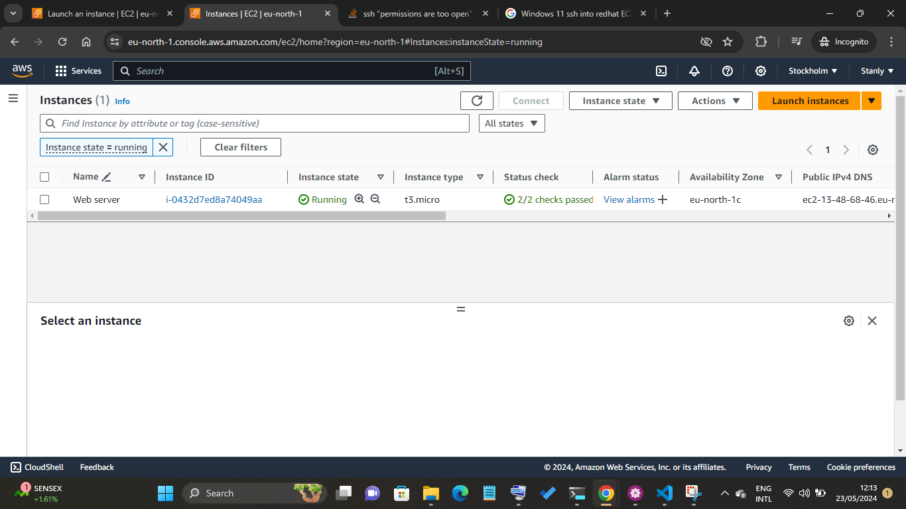


### STEP 2: CREAT AND ATTACH EBS VOLUMES:

In the management console, create three EBS volumes of 10 GiB each in the same AZ as the webserver instance

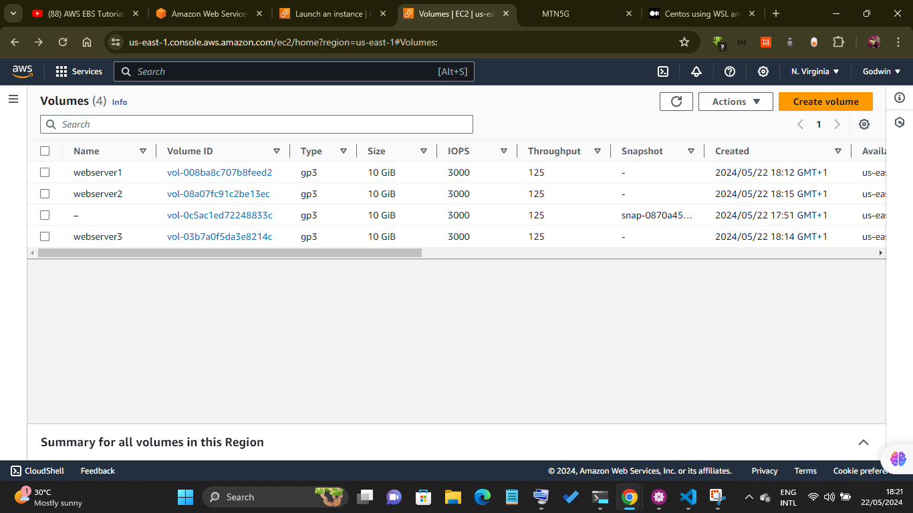

To inspect what block device are attached to the server run:

```
lsblk
```

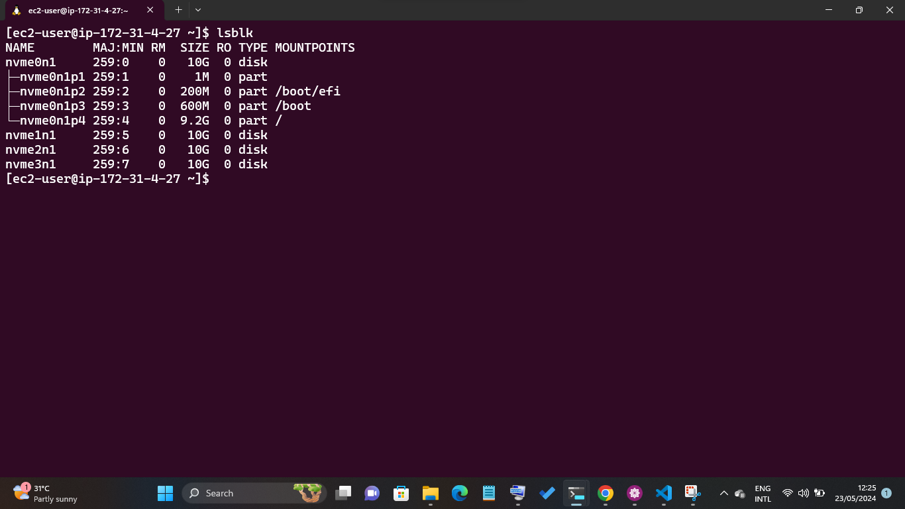


### STEP 3: PARTITION OF EBS VOLUMES(Web Server):

Create a signgle partition on each of the 3 disks using the gdisk command.

first run ``df -h`` command to see all mounts and free space on your server.
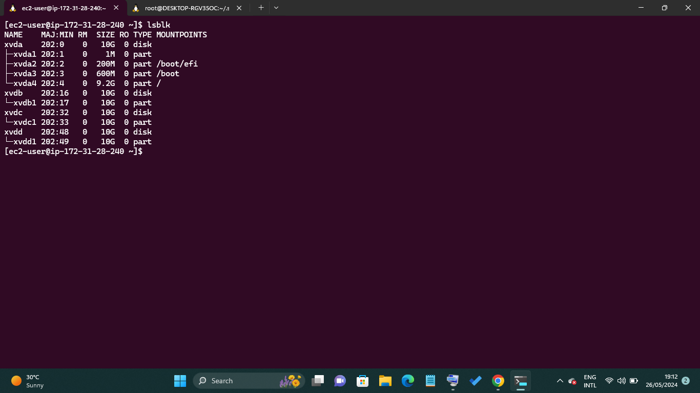


Creating the 3 partition
```
sudo gdisk /dev/xvdb
```

```
sudo gdisk /dev/xvdc
```

```
sudo gdisk /dev/xvdd
```

Follow the interactive prompts to create partitions for each EBS volume, ensuring sufficient space for WordPress installation.

WEB-SOLUTION/PHOTO/output-partition.png

### STEP 4: INSTALL LVM PACKAGES(Web Server):


Install the Logical Volume Manager (LVM) package using the following command:

```
sudo yum updata

sudo yum install -y lvm2
```

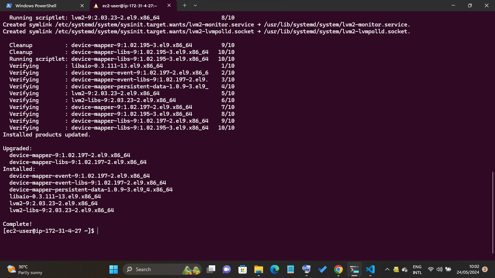


### STEP 5: CHECK AVAILABLE PARTITIONS:

Use the command below to list all available physical partitions for LVM management.

```
sudo lvmdiskscan
```
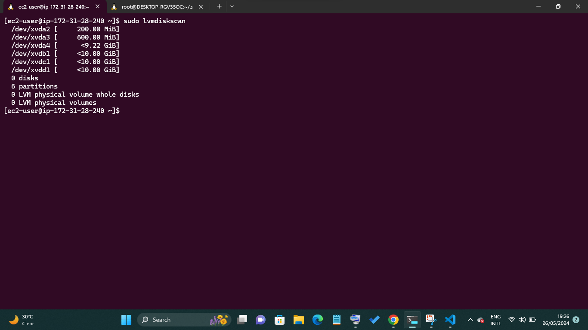


### STEP 6: CREATING A PHSICAL VOLUME

Use the ``sudo pvcreate ``command to mark each of the newly created partitions as physical volumes (PVs) that LVM can use.

```
sudo pvcreate /dev/xvdb1 /dev/xvdc1 /dev/xvdd1 
```

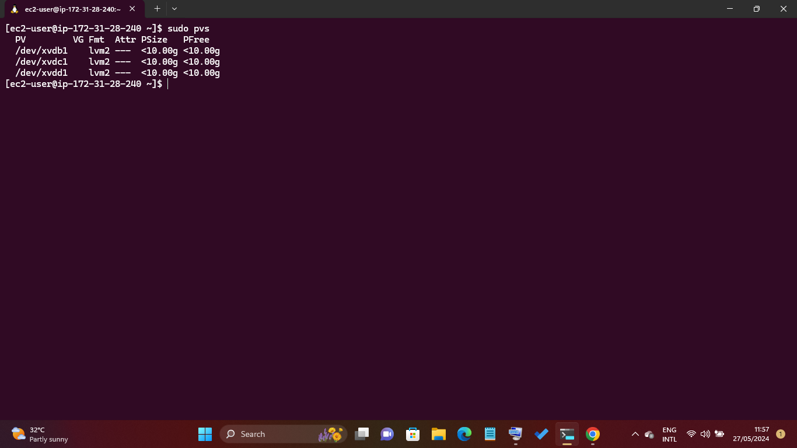

### STEP 7:ADDING PYSICAL VOLUME TO GROUP:

Use vgcreate utility to add all 3 PVs to a volume group (VG). Name the VG webdata-vg

```
sudo vgcreate webdata-vg /dev/xvdb1 /dev/xvdc1 /dev/xvdd1 
```

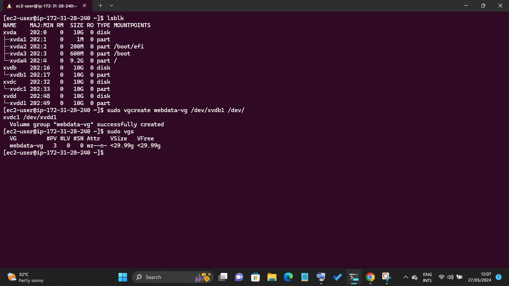


### STEP 8: create two logical volume

Use lvcreate utility to create 2 logical volumes. apps-lv (Use half of the PV size), and logs-lv Use the remaining space of the PV size. NOTE: apps-lv will be used to store data for the Website while, logs-lv will be used to store data for logs.


```
sudo lvcreate -n apps-lv -L 14G webdata-vg
sudo lvcreate -n logs-lv -L 14G webdata-vg

#To verify run:
sudo lvs
```

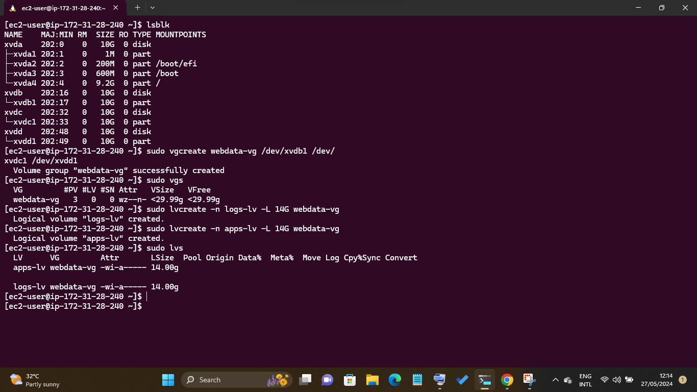

### STEP 9: Formating logical volume

Use mkfs.ext4 to format the logical volumes with ext4 filesystem

```
sudo mkfs -t ext4 /dev/webdata-vg/apps-lv
sudo mkfs -t ext4 /dev/webdata-vg/logs-lv
```

### STEP 10: Creating Backups directory

```
# reate /var/www/html directory to store website files
sudo mkdir -p /var/www/html

# Create /home/recovery/logs to store backup of log data
sudo mkdir -p /home/recovery/logs
```

### STEP 11: Mounting and rsync apps-lv and logs-lv

Mount /var/www/html on apps-lv logical volume and use rsync utility to backup all the files in the log directory /var/log into /home/recovery/logs

```
sudo mount /dev/webdata-vg/apps-lv /var/www/html/

sudo rsync -av /var/log/ /home/recovery/logs/
```

Also do same for logs-lv and restore file back to /var/log directory

```
sudo mount /dev/webdata-vg/logs-lv /var/log

sudo rsync -av /home/recovery/logs/ /var/log
```
### STEP 13: Updating the /etc/fstab and reload the daemon

The UUID of the device will be used to update the /etc/fstab file;

``sudo blkid``

Update /etc/fstab in this format using your own UUID and rememeber

```
sudo vi /etc/fstab
```

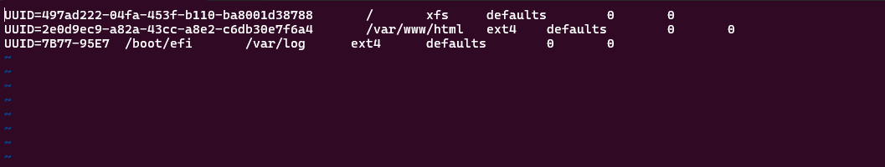

Finally test the configuration and reload the daemon

```
sudo mount -a
sudo systemctl daemon-reload 
```

### STEP 14:  Install WordPress on your Web Server EC2

```
# Update the repository:
sudo yum -y update

# Install wget, Apache and it's dependencies:
sudo yum -y install wget httpd php php-mysqlnd php-fpm php-json

# Start and enable Apache:
sudo systemctl enable httpd
sudo systemctl start httpd

# To install PHP and it's dependencies:
sudo yum install https://dl.fedoraproject.org/pub/epel/epel-release-latest-8.noarch.rpm

sudo yum install yum-utils http://rpms.remirepo.net/enterprise/remi-release-8.rpm

sudo yum module list php

sudo yum module reset php

sudo yum module enable php:remi-7.4

sudo yum install php php-opcache php-gd php-curl php-mysqlnd

sudo systemctl start php-fpm

sudo systemctl enable php-fpm setsebool -P httpd_execmem 1

# Restart Apache:
sudo systemctl restart httpd
```
test if php is working 
```
 sudo vi /var/www/html/info.php
```

write the following code to check php config

```
<?php
phpinfo();
?>
```
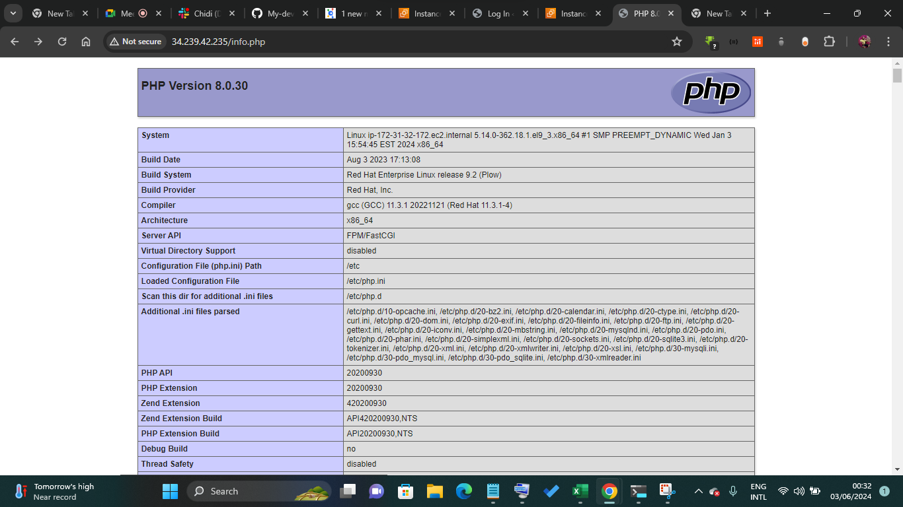

### Download wordpress and copy wordpress to /var/www/html:
```
mkdir wordpres

cd wordpress

sudo wget http://wordpress.org/latest.tar.gz 

sudo tar xzvf latest.tar.gz

sudo rm -rf latest.tar.gz cp wordpress/wp-config-sample.php wordpress/wp-config.php

sudo cp -R wordpress /var/www/html/

# Configure SELinux Policies:

sudo chown -R apache:apache /var/www/html/wordpress

sudo chcon -t httpd_sys_rw_content_t /var/www/html/wordpress -R

sudo setsebool -P httpd_can_network_connect=1
```
**Outputs**
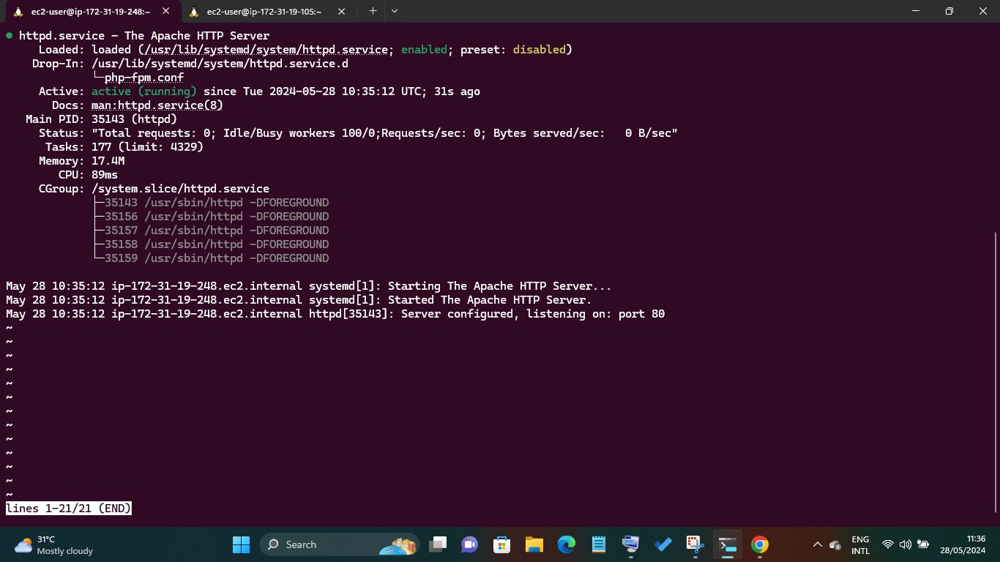
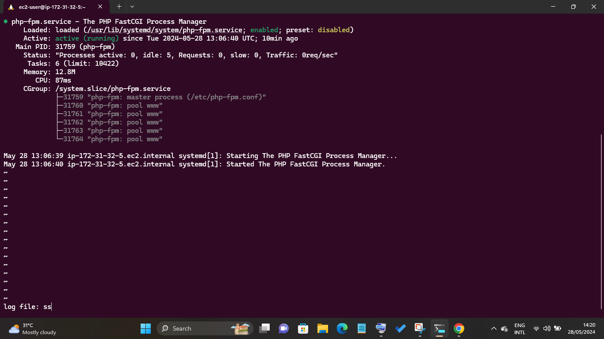

### PART 2:

lunch an EC2 instance with name **DB SERVER**. 

### STEP 1: Prepare the Database Server
Launch a second RedHat EC2 instance with the DB SERVER

Repect the same steps from step 1. to 13. As was done in WEB SERVER, but instead of apps-lv create db-lv and mount it to /db directory instead of /var/www/html/.

### STEP 2: Install MySQL on your DB Server EC2

```
sudo yum update
sudo yum install mysql-server
```
Verify that the service is up and running by using sudo systemctl status mysqld, if it is not running, restart the service and enable it so it will be running even after reboot:

```
sudo systemctl restart mysqld
sudo systemctl enable mysqld
sudo systemctl status mysqld
```


### STEP 3: Configure DB to work with WordPress

```
sudo mysql
CREATE DATABASE wordpress;
CREATE USER `myuser`@`<Web-Server-Private-IP-Address>` IDENTIFIED BY 'mypass';
GRANT ALL ON wordpress.* TO 'myuser'@'<Web-Server-Private-IP-Address>';
FLUSH PRIVILEGES;
SHOW DATABASES;
exit
```
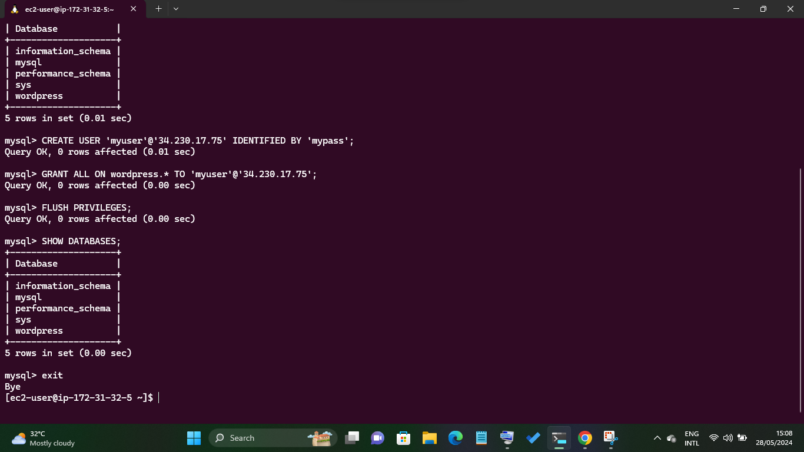

### STEP 4: Configure WordPress to connect to remote database.

**NOTE:** To this open MySQL port 3306 on DB Server EC2. For extra security, you shall allow access to the DB server ONLY from your Web Server's IP address, so in the Inbound Rule configuration specify source as /32

### PART 3

### STEP 1: install MySQL client and test

Install MySQL client and test that you can connect from your Web Server to your DB server by using mysql-client

```
sudo yum install mysql
sudo mysql -u admin -p -h <DB-Server-Private-IP-address>
```
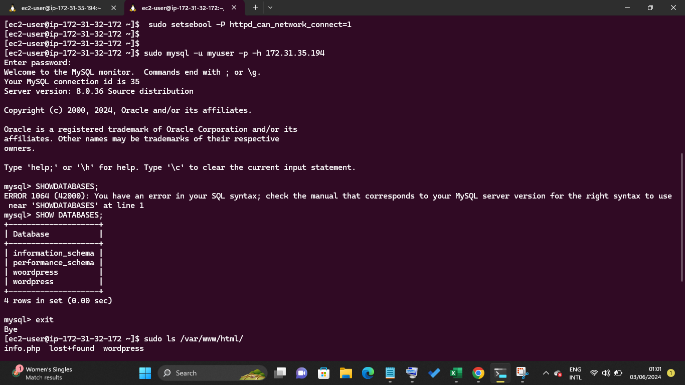
### STEP 2: The final step.

Do the follow to get your wordpress started:

1. Verify if you can successfully execute ``SHOW DATABASES``; command and see a list of existing databases.
2. Change permissions and configuration so Apache could use WordPress.
3. Enable TCP port 80 in Inbound Rules configuration for your Web Server EC2 (enable from everywhere 0.0.0.0/0 or from your workstation's IP)
4. Try to access from your browser the link to your WordPress http://<Web-Server-Public-IP-Address>/wordpress/

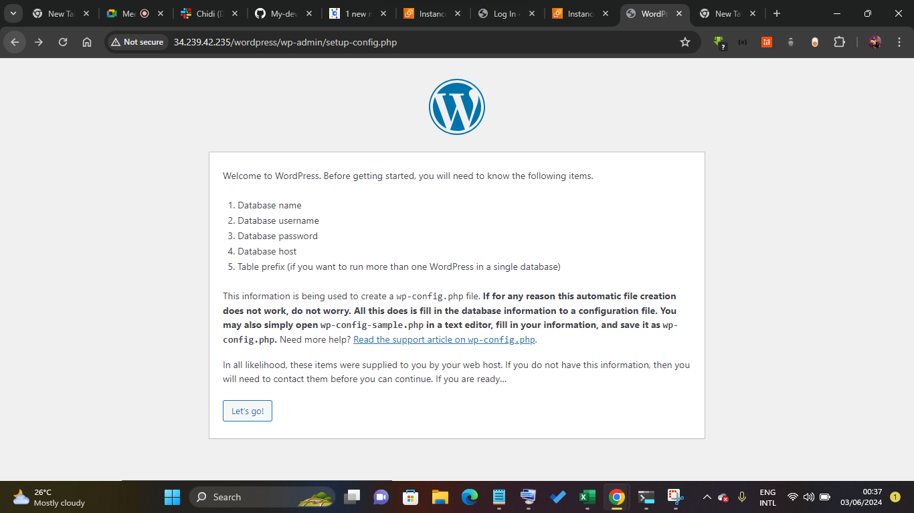

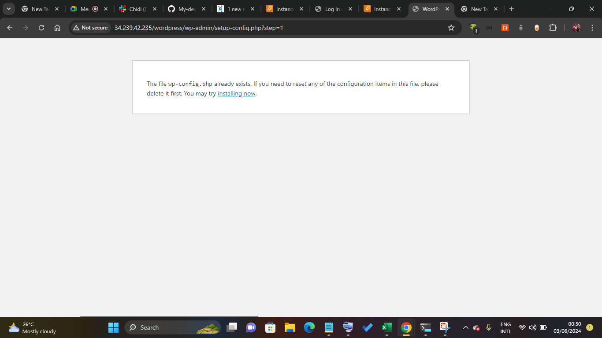

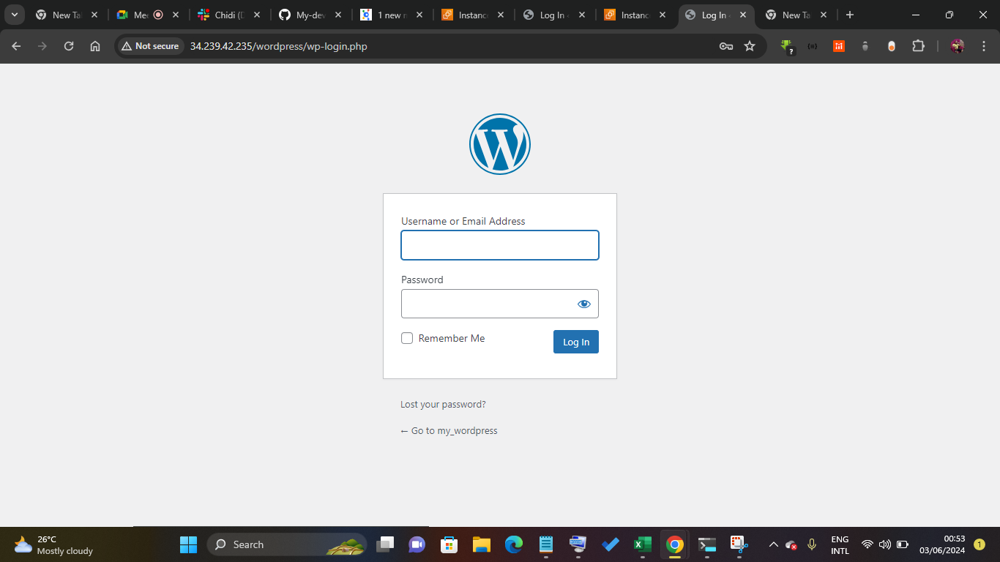

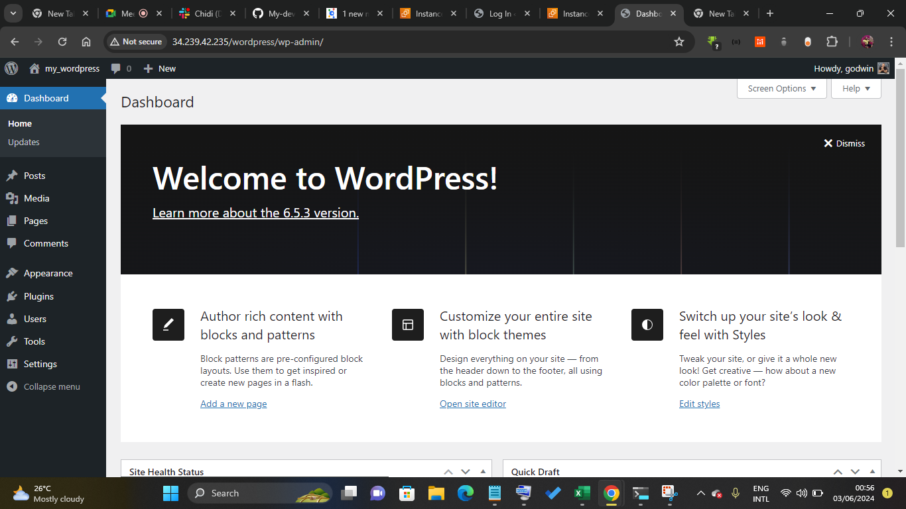


#### In this course, we have successfully created our instances, mount our volume to it, partitioned it and have also configured our apache, php and mysql in the respective instance following our above steps. wordpress has as well been successfully sarted with a user name created. 