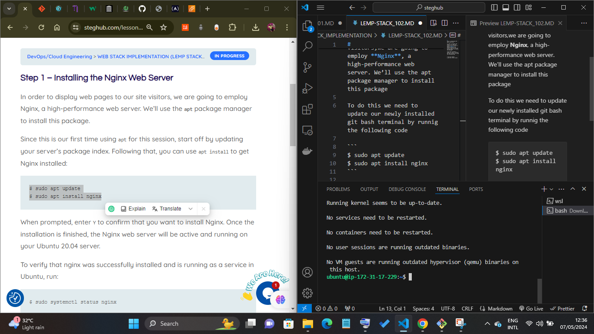
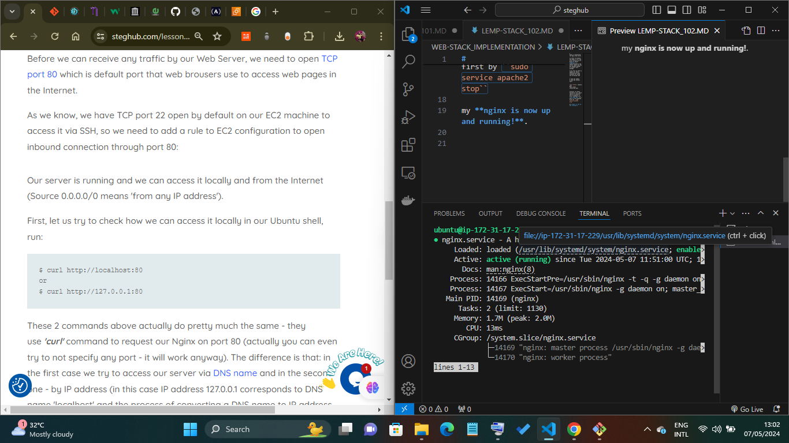
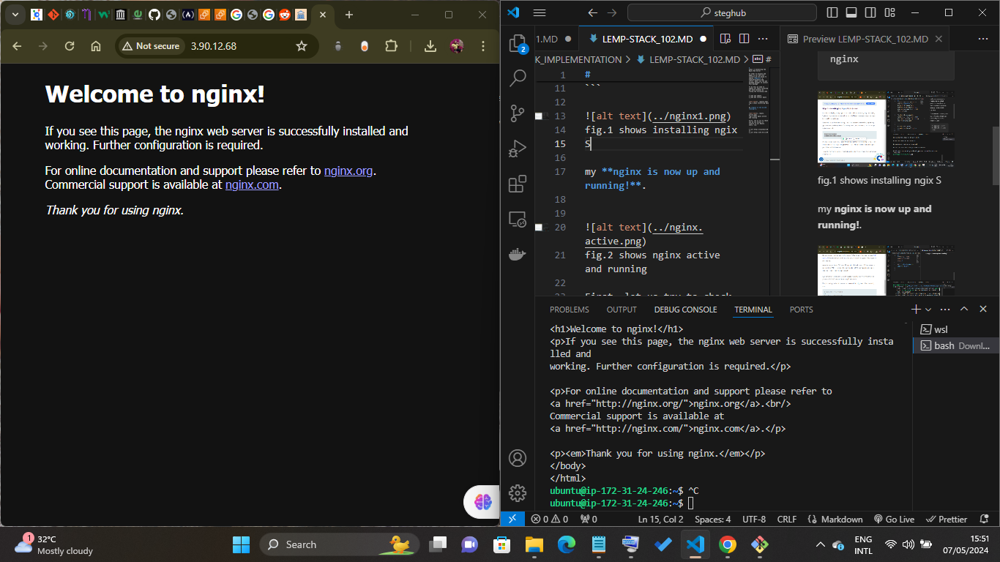

#
Step 1 – Installing the Nginx Web Server

In order to display web pages to our web site visitors,we are going to employ **Nginx**, a high-performance web server. We’ll use the apt package manager to install this package 

To do this we need to update our newly installed git bash terminal by runnig the following code

```
$ sudo apt update
$ sudo apt install nginx
```


fig.1 shows installing ngix
S

my **nginx is now up and running!**.



fig.2 shows nginx active and running

First, let us try to check how we can access it locally in our Ubuntu shell, run:

```
$ curl http://localhost:80
or
$ curl http://127.0.0.1:80
```


fig.3 show my nignx started at localhost:80 