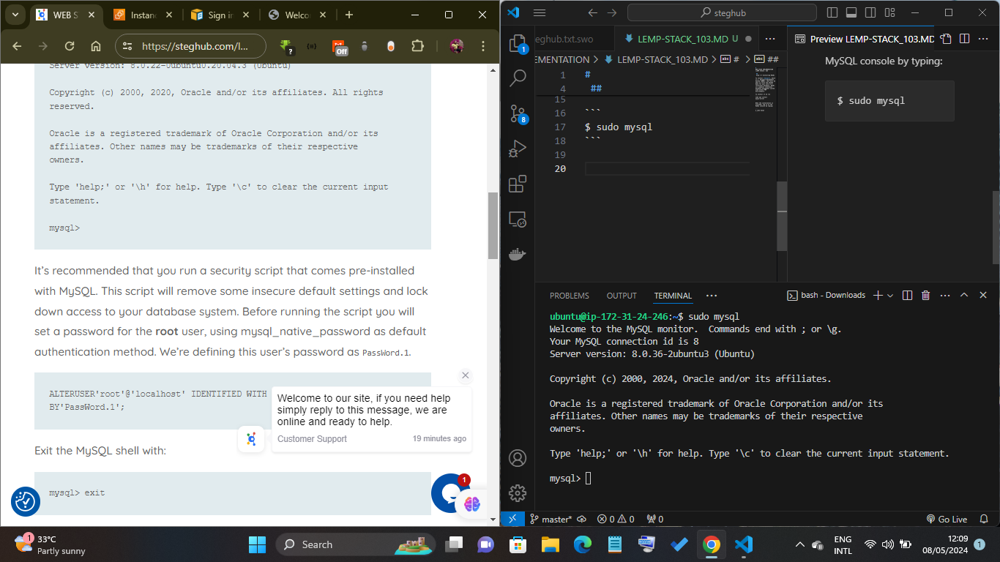

# WEB STACK IMPLEMENTATION (LEMP STACK)- 103

 ## Step 2 — Installing MySQL

To install **mysql**, which is a  Database Management System (DBMS), this will be able to store and manage data for your site in a relational database. MySQL is a popular relational database management system used within PHP environments.

to install it we run
```
sudo apt install mysql-server
```

When the installation is finished, log in to the MySQL console by typing:

```
$ sudo mysql
```


fig 1. shows installing mysql successful

## RUNNING A SECURITY SCRIPT ON MYSQL

It’s recommended that you run a security script that comes pre-installed with MySQL. This script will remove some insecure default settings and lock down access to your database system. Before running the script you will set a password for the root user, using mysql_native_password as default authentication method. We’re defining this user’s password as PassWord.1.

To set it up run:
```
ALTERUSER'root'@'localhost' IDENTIFIED WITH mysql_native_password BY'PassWord.1';
```

I noticed this error
```
ERROR 1064 (42000): You have an error in your SQL syntax; check the manual that corresponds to your MySQL server version for the right syntax to use near 'ALTERUSER'root'@'localhost' IDENTIFIED WITH mysql_native_password BY'PassWord.1'' at line 1
```
at the cost of research i found out the  **ALTERUSER is like this ALTER USER**
Therefore the currect code is this 

```
ALTER USER'root'@'localhost' IDENTIFIED WITH mysql_native_password BY'PassWord.1';
```
Exit the MySQL shell with:
```
mysql> exit
```
Start the interactive script by running:

```
$ sudo mysql_secure_installation
```
This will ask if you want to configure the VALIDATE PASSWORD PLUGIN.

Note: Enabling this feature is something of a judgment call. If enabled, passwords which don’t match the specified criteria will be rejected by MySQL with an error. It is safe to leave validation disabled, but you should always use strong, unique passwords for database credentials.

Answer Y for yes, or anything else to continue without enabling.


When you’re finished, test if you’re able to log in to the MySQL console by typing:

```
$ sudo mysql -p
```


